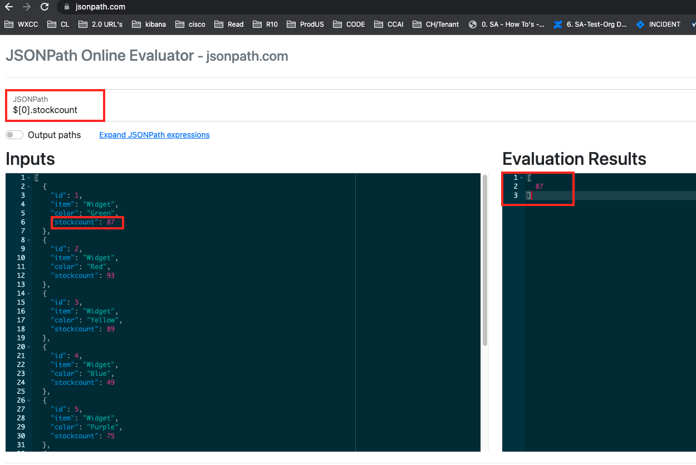

# Table of Contents
- [Table of Contents](#table-of-contents)
- [Introduction](#introduction)
    - [Lab Objective](#lab-objective)
    - [Pre-requisites](#pre-requisites)
    - [Quick Links](#quick-links)
- [Lab Section](#lab-section)
  - [Step 1. Integrate Task bot into the flow](#step-1-integrate-task-bot-into-the-flow)
  - [Step 2. Add Live Chat and Append Conversation nodes](#step-2-add-live-chat-and-append-conversation-nodes)
  - [Step 3. Check Intent, parse Entities and get number of Items](#step-3-check-intent-parse-entities-and-get-number-of-items)
  - [Step 4: Send the answer to the created conversation](#step-5-send-the-answer-to-the-created-conversation)

 

# Introduction

## Lab Objective

In this lab we will modify the default Chat Flow to integrate our task bot. We will collect the intents from the end-customer and get the value of the requested information using HTTP Requests.

### Pre-requisites

1. You have received the access credentials with a full admin access 
2. Lab 2 should be completed successfully and chat routing to agent is working
3. The previous sections in Lab 4 should be completed successfully

### Quick Links

> Control Hub: **[https://admin.webex.com](https://admin.webex.com){:target="_blank"}**\
> Portal: **[https://portal.wxcc-us1.cisco.com/portal](https://portal.wxcc-us1.cisco.com/portal){:target="_blank"}**\
> Agent Desktop: **[https://desktop.wxcc-us1.cisco.com](https://desktop.wxcc-us1.cisco.com){:target="_blank"}**\
> Connect: https://cl2pod**X**.imiconnect.io/ (where **X** is your POD number)

# Lab Section

> **NOTE**: Please read carefully the lab guide and follow the instructions. It might be possible that some GIFs are not accurate.
{: .block-warning }

## Step 1. Integrate Task bot into the flow

- Login to Webex Connect > Assets > Identify the appID of the chat asset created in step-2

- Download the template bot flow from this link: [pre-configured task bot flow](ChatFlow_TaskBot.workflow){:target="\_blank"}

- Navigate to Services > Click the service in which the chat configurations were created

- Navigate to Flows > Create Flow

- Input desired  **Flow Name**, select **Method** as 'Upload a flow' and choose the flow downloaded in the first step of this section

- Click **Create**

- In the Configure APP event node, click **Save**

- Navigate to settings in the top right and update the appID (value identified in Step-1) and click Save

- We must select the correct Live Chat Template as configured earlier so that the right Form is presented to the customer. Click on the `Pre-chat form` node and select `Form Template` as configured earlier and `Save`

 
 

- The same must be done in the Receive node, double click on it and select the Form from the dropdown menu and `Save`

 
 

- Open the Queue task node and select the chat queue created in Lab-2

- Open the Receive Node and update the Transition Actions:

    > Add Action
    >
    > Time: On-Leave
    > 
    > Action: Set Variable
    >
    > Variable: message
    >
    > Value: Output Varriables > InApp - Form Response > inappmessaging.message $(n38.inappmessaging.message), Click Save.

 

- Find the Create Task node and delete the green line that says created, which connects to the queue Task node.

- Add Task Bot node and link it with the Create Task node

 

- Open the Task Bot node and update the following parameters
    >Select the task bot created in previous lab.
    >Message: Custom Variables > messageForBot $(messagetext)
    >
    >Channel: In-App
    >
    >Unique ID: Custom Variables > conversationId $(conversationId)
    >
    >Customer Parameters 
    >> Key: name\
    >> Value: Receive > InApp - Form Response -> $(n38.inappmessaging.formFields.Name)

 

## Step 2. Add Live Chat and Append Conversation nodes

- Add Live Chat or In-App Messaging Node and link it with the Task Bot node

- Link the Task Bot node also with the Queue Task Node. It will automatically create the connection for onAgentHandover

 
- Open the Live Chat or In-App Messaging Node and update the following parameters:
    > Destinaton Type: UserId
    >
    > Destination: Start > inapppessaging.userId $(n2.inappmessaging.userId)
    >
    > Message: Task Bot > taskbot.text_response $(n2300.taskbot.text_response) [Node number may vary, pls see the video and copy paste th value accordingly]
    >
    > Thread ID: Start > inappmessaging.threadId $(n2.inappmessaging.threadId)

 
- Add Append Conversation Node and link it with the Live Chat or In-App Messaging node

 
- Open the Append Conversation Node and update the following parameters:
    
	> Method Name: Append Chat
	>
	> Node Runtime Authorization: Pick default
	>
    > Channel: Livechat
    >
    > Conversation ID: Custom Variables > conversationId  $(conversationId) [If red warning appears copy paste the same value again]
    >
    > Message Type: Text With Attachments
    >
    > Direction: Outbound
    >
    > Text: Task Bot > taskbot.text_response $(n2300.taskbot.text_response)
    >
    > Timestamp: Start > inappmessaging.timestamp $(n2.inappmessaging.timestamp)
    >
    > Attachments: null

  **NOTE**: If any of the variables above shows with red indicator below the value of text box, please copy the value and paste it again, this will bypass red warning.
    

 
- Add a Receive node and link it with the Append Conversation node

 
- Open the Receive Node and update the following parameters:
	> Select Incoming Message/Event: Receive Live Chat In-App Messaging   
	>
	> Max timeout: 300
    >
    > From(threadID): Start > inappmessaging.threadId $(n2.inappmessaging.threadId)
    >
    > From(userId): Start > inappmessaging.userId $(n2.inappmessaging.userId)
    >
    >Event name: Incoming Message
    >
    >Click Transition Actions in the next tab

    >> Add Action
    >
    > >Time: On-Leave
    > 
    > >Action: Set Variable
    >
    > >Variable: messagetext
    >
    > >Value: Output Variables > Receive -> InApp- Incoming Message -> $(n2303.inappmessaging.message)

 

- Add Append Conversation Node and link it with the Receive node

 

- Open the Append Conversation Node and set the following parameters
    
	> Method Name: Append Chat
	>
	> Node Runtime Authorization: Pick default
	>
    > Channel: Livechat
    >
    > Conversation ID: $(conversationId)
    >
    > Message Type: Text With Attachments
    >
    > Direction: Inbound
    >
    > Text: CUstom Variables -> messagetext $(messagetext)
    >
    > Timestamp: Start > inappmessaging.timestamp $(n2.inappmessaging.timestamp)
    >
    > Attachments: null
    >
   **NOTE**: If any of the variables above shows with red indicator below the value of text box, please copy the value and paste it again, this will bypass red warning.

 

- Drag the green node edge from the Append Conversation Node and connect it to the Task Bot Node    

- For each Red or Orange edges of each Flow nodes that we just added, drag a connector to the Close Conversation node until you can no longer grab any new node edges.

 

- Save the Flow and click on Make Live

- Select your Application and add any publish comments 

- You can launch chat from website and test everything works untill this point before proceeding with next section.

## Step 3. Check Intent, parse Entities and get number of Items

- Find the Task bot node and **delete** the **onSuccess** connector

- Add a Branch node and link it with the Task bot node

- Open the Branch node and set the following parameters
  > Rename Branch1: checkStock
  >  
  > Variable: Task Bot > taskbot.intent [$(n2300.taskbot.intent)]
  >
  > Condition: Equals
  >
  > Value: Check Stock [Value provided for intent on Task Bot]
  >
  > Click Save.
  >

 

  - Drag a new Data Parser node and link it with Branch node (checkStock edge)

  - Connect 'None of the above' edge of branch node to 'Live Chat on In-App Messenger' node by dragging it out of middle.

  - Connect red node edges from the Data Parser and branch node to the Live Chat on In-App Messenger untill you cannot drag the edges anymore.

  - Open the Data Parser node and set the following parameters:
    > Input: Task Bot > taskbot.entities [$(n2300.taskbot.entities)]
    >
    > Sample Body: Paste the below JSON.
        
              { 
								    "Color": {
								        "metadata": {
								            "confidence":100
								        },"synonym":"Red","name":"Color","entity_id":"2","value":"Red"
								    },"StockItem": {
								        "metadata": {
								            "confidence":100
								        },"synonym":"Bobbles","name":"StockItem","entity_id":"1","value":"Bobbles"
								    }
							}

    > >Click Parse
    >
    > Select the $.Color.value and $.StockItem.value
    > 
    > >Click Import
    >
    > Create Output variable names (like Color and Item)
    > 	$.Color.value -> Color\
    > 	$.StockItem.value -> Item
    >
    > >Make both Variables Mandatory and click Save.

 
 
  - Drag a new Branch node and link it with the Data Parser node

  - Open the Branch node and set the following parameters:
    > Rename Branch1 to Widget
 >> Variable: Data Parser > Item [$(n2310.Item)]
 >> Condition: Equals
 >> Value: widget
 >> 
 >> 
 >Click on add branch, Rename Branch2 to Bobble
 >> Variable: Data Parser > Item [$(n2310.Item)]
> > Condition: Equals
 >> Value: bobble -> Click Save.
> Connect 'None of the above' edge of branch node to 'Live Chat on In-App Messenger' node by dragging it out of middle.
 > **NOTE**: Connect Red node edges of branch node ti Live chat or in app messaging node.

 
  - Drag 2 HTTP Request nodes into the flow and connect them with the Branch node (select Widget for one of them and Bobble for the other one)

  - Open one of the HTTP Request nodes that you have connected for **Widget** path.

  - Click on Transition Actions and set the following parameters:
    > Click Add Action
    >
    > Time: On-Enter
    >
    > Action: Set Variable
    >
    > Variable:
      >>
      >> Add an new variable
      >>
      >> Variable name: stockURL [Leave default value as blank]
      >>
      >> Click Save
    >
    > Value: Paste this URL  'https://629f77cc8b939d3dc2987fa4.mockapi.io/api/v1/Widget?' and append it with Data Parser -> Color (Example: $(n2310.color))
    > In the end URL may look like 'https://629f77cc8b939d3dc2987fa4.mockapi.io/api/v1/Widget?$(n2310.Color)'
    > 	Be aware that n2310 is an example, make sure to put correct NodeID of Parser node
    >

  - Click Configuration
    > Method: GET
    >
    > Endpoint URL: Custom Variables > stockURL
    >
    > Connection Timeout: 1000
    >
    > Request Timeout: 1000
    >
    > Click on +Add variable under Output Variables and provide Name as: itemCount
    >
    > Response Entity: Body 
    >
    > Response Path: $[0].stockcount [This value is derived from hitting the rest endpoint and parsing it using JSON path expression tester online For Example in case the Color is green, the URL will look like - https://629f77cc8b939d3dc2987fa4.mockapi.io/api/v1/Widget?$green, Run this from browser and check response. and then use https://jsonpath.com/ to extract the value you would like as shown in screen shot below.]
    >
    
     
  - Click Transition Actions
    > Add action
    >
    > Time: on-leave
    >
    > Action: Set variable
    >
    > Variable: messagetext
    >
    > Value: There are (output variables > itemCount) (Data Parser > color) (Data Parser > item)s in stock. Is there anything else I can do for you?  
    > [The above sentense in the end will look like - There are $(n2312.itemCount)  $(n2310.Color) $(n2310.Item) in stock, Is there anything else I can do for you?]
  

 
- Do the same with the other HTTP Request node for '**Bobble** connection.
  - You need to change the Value of the stockURL with the appropiate entity: (Example: https://629f77cc8b939d3dc2987fa4.mockapi.io/api/v1/Bobble?color=$(n2316.color))
  - and the correct node number for itemcount in the OutPut message. [There are $(n2312.itemCount)  $(n2310.Color) $(n2310.Item) in stock, Is there anything else I can do for you?]
  - Rest of the config will be same. you can follow the above steps in order to configure other HTTP node.

## Step 4. Send the answer to the created conversation

- Drag a new Live Chat or In-App Messaging node and link it with both HTTP Request nodes

  - Open the Live Chat or In-App Messaging node and set the following parameters:
    > Destination type: UserId
    >
    > Destination: Start > inapppessaging.userId $(n2.inappmessaging.userId)
    >
    >Message Type: Message 
    >
    >Message: Custom Variables > messagetext
    >
    > Thread ID: Start > inappmessaging.threadId $(n2.inappmessaging.threadId)
    >
    

 
  - Drag a new Append Conversation and link it with the Live Chat or In-App Messaging node

  - Open the Append Conversation node and set the following parameters:
    > Method Name: Append Chat
    >
    > Node Runtime Authorization: Pick default
    >
      > Channel: Livechat
      >
      > Conversation ID: Custom Variables > conversationId
      >
      > Message Type: Text With Attachments
      >
      > Direction: Outbound
      >
      > Text: Custom Variables -> messagetext $(messagetext)
      >
      > Timestamp: Start > inappmessaging.timestamp 
      >
      > Attachments: null
      >
     **NOTE**: If any of the variables above shows with red indicator below the value of text box, please copy the value and paste it again, this will bypass red warning.

 
  - Connect the Green node edge of Append conversation to the Receive node 

  - Connect all remaining Red and Orange node edges to the Close Conversation node 

  - Click Save in the upper right corner and make it live

  - Confirm the proper application is selected and Click Make Live again.

 
- Navigate to your website (The one defined as Channel Asset in Webex Engage) and test your bot.

Questions to bot - Do you have green bobbles?
           Do you have red widgets?

  

[Back to top](#table-of-contents)

### Congratulations, you have completed this section! 

<button onclick="mainPage()" style="
  border-radius: 5px;
  background-color: rgb(116,191,75);
  padding: 10px;">Go to the Previous Lab</button>

<button onclick="nextLab()" style="
  position: absolute;
  right: 200px;
  border-radius: 5px;
  background-color: rgb(116,191,75);
  padding: 10px;">Go Back to HOME Page</button>

