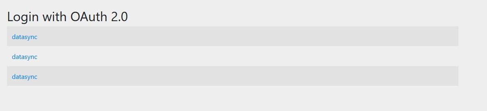
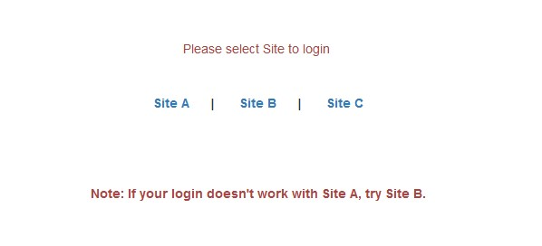
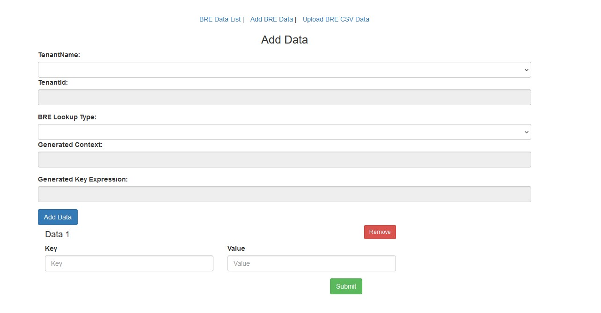
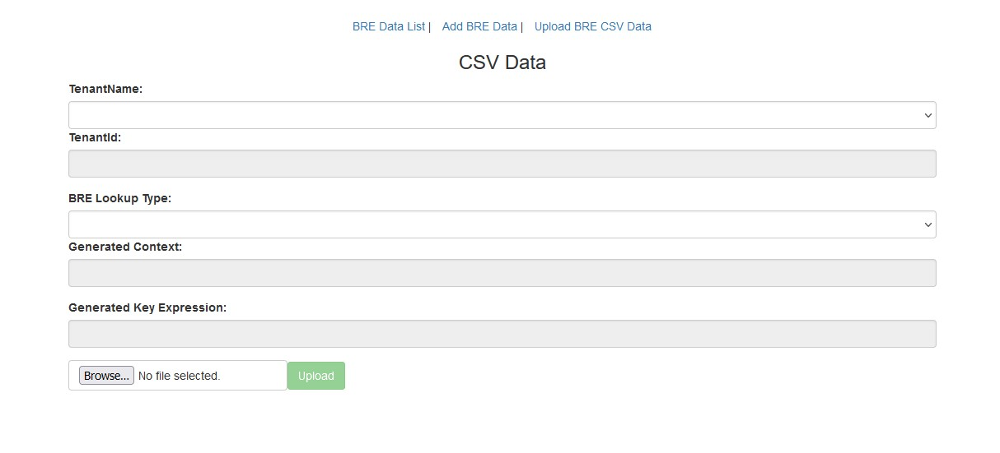
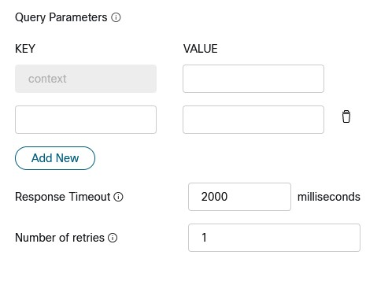
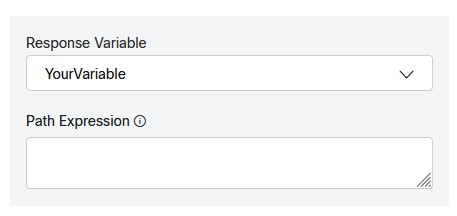

## Before You Begin
Ask your CSM to create a BRE Table for you

You can access the BRE data here: https://rules.wxcc-us1.cisco.com/datasync

---

## Fill in the form with the necessary details and click "Update Directions" 
<form>
  
  <label for="context">Table Name Created by CSM:</label> 
  <input type="text" id="context" name="context"> 
  
  <label for="label">Label Name (keep default unless you have a reason):</label> 
  <input type="text" id="label" name="label" value="routeInfo"> 
  
  <label for="key">Key to be used in flows:</label> 
  <input type="text" id="key" name="key"> 
 

  <button onclick="update()">Update Directions</button>
</form>

---

## Preparing the tenant to use the BRE:

 ⚠️ **Important note:** All BRE are settings, rules, attributes, and labels are case sensitive!

#### Navigate the Business Rules 
> In the BRE
>
>
>> Click Attributes in the top ribbon 
>>
>> Click Add  
>> 
>>> Name: context (case sensitive) 
>>>
>>> Data Type: Text
>>>
>>> Click Save
>>
>> Click Labels in the top ribbon
>>
>>> Click Add 
>>>
>>> Name: <w class="label_out">routeInfo</w> (case sensitive)
>>>
>>> Click Save
>>
>> Click Context in the top ribbon
>>
>>> Click Add Context 
>>>
>>> Name: <w class = "context_out">Table/Context that your CSM created for you</w> (case sensitive) 
>>> 
>>> Attribute: context 
>>>
>>> Click Save
>>
>> Click on the line of the Context you just created (<w class = "context_out"></w>)
>>
>>
>> Add the rules listed below

#### Found rule

> Click on Add Rule (Editor)
> 
> Name: <w class="context_out"></w>Found
> 
> Active: True
> 
> Label: <w class = "label_out">routeInfo</w>
>
> Priority: 100
>
> Copy the rule into the editor:
>
>> <textarea id="foundruleDisplay" style="width: 1100px; height: 100px;" readonly>when
>>    c: Contact()
>>    eval(c.getGlobalValuesManager().getAsString( c.getTenantId(), c.getAttribute("context") + "." + c.getAttribute("ani")) != null)
>> then
>>    c.putAttribute("routeInfo", c.getGlobalValuesManager().getAsString(c.getTenantId(), c.getAttribute("context") + "." + c.getAttribute("ani")));
>> end </textarea> 

<ww id="foundRule" style="display: none" >when 
    c: Contact() 
    eval(c.getGlobalValuesManager().getAsString( c.getTenantId(), c.getAttribute("context") + "." + c.getAttribute("<w class = "key_out">ani</w>")) != null) 
then 
    c.putAttribute("<w class = "label_out">routeInfo</w>", c.getGlobalValuesManager().getAsString(c.getTenantId(), c.getAttribute("context") + "." + c.getAttribute("<w class = "key_out">ani</w>"))); 
end  </ww>

#### NotFound rule

> Click on Add Rule (Editor)
> 
> Name: <w class="context_out"></w>Notfound
> 
> Active: True
> 
> Label: <w class = "label_out">routeInfo</w>
>
> Priority: 99
>
> Copy the rule into the editor:
>
>
>> <textarea id="notfoundruleDisplay" style="width: 1100px; height: 100px;" readonly>when
>>    c: Contact()
>>    eval(c.getGlobalValuesManager().getAsString( c.getTenantId(), c.getAttribute("context") + "." + c.getAttribute("ani")) == null)
>> then
>>   c.putAttribute("routeInfo", "NotFound");
>> end </textarea> 

<ww id="notfoundRule" style="display: none" >
when 
    c: Contact() 
    eval(c.getGlobalValuesManager().getAsString( c.getTenantId(), c.getAttribute("context") + "." + c.getAttribute("<w class = "key_out">ani</w>")) == null) 
 then 
   c.putAttribute("<w class = "label_out">routeInfo</w>", "NotFound"); 
 end 
</ww>

## Adding, updating, and removing data from your BRE table
### Logging in
> Navigate to [https://rules.wxcc-us1.cisco.com/datasync/login](https://rules.wxcc-us1.cisco.com/datasync/login){:target="_blank"}
>
> 
 
Click datasync link

> 
>
> 

>
>
>> Login using your tenant admin credentials if prompted
>
> 
 
Select Site A

> 
>
> 

>
> ---

### Adding and updating data
>
> 
 
Click Add BRE Data

> 
>
> 

>
> Select your tenant name from the Tenant Name drop down
>
> Select the table name you want to add/update data to in the BRE Lookup Type drop down
>
> Add the value you will be looking up in the Key field
>
> Add the value you want to be returned in the Value field
>
> Clicking Add Data will let you add additional rows
>
> Clicking the Remove button will remove teh row from your Add/Update
>
> Click Submit to save the updates
>
> ---

### Adding, updating and removing data in bulk
>
> 
 
Click Upload BRE CSV data

> 
>
> 

>
>
> Create a CSV file with 3 columns
>
> > ⚠️ CSV must have headers in the file or the first row will be skipped 
> >
> > Key: the value you will be looking up
> >
> > Value: the value you want to be returned
> >
> > Action: the action you want taken on the key (ADD, UPDATE, DELETE)
>
>
> Select your tenant name from the Tenant Name drop down
>
> Select the table name you want to add/update data to in the BRE Lookup Type drop down
>
> ---

## Accessing the BRE data from your flow
> 

> 
> <w style="position: absolute; top: 27%; left:53%; color: rgb(0,0,0);" class = "context_out">table</w>
> <w style="position: absolute; top: 41%; left: 8%; color: rgb(0,0,0)" class = "key_out">ani</w>
> <w style="position: absolute; top: 41%; left: 53%; color: rgb(0,0,0)">your lookup value</w>
> 

---

## Parsing BRE data to a variable
> 
<w style="position: relative; top: -80px; left:55px; color: rgb(0,0,0)">$.</w>
<w style="position: relative; top: -80px; left:52px; color: rgb(0,0,0)" class = label_out>routeInfo</w>

---

 