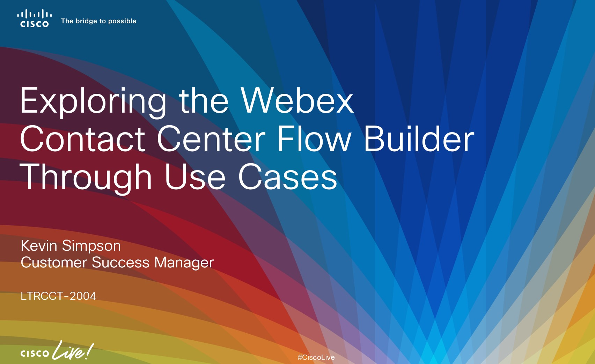

|Lab|Topic|Lab Link|
|---|---|---|
|Lab 0|Initial setup and configuration|[Preconfiguration and validation](Lab_0.md){:target="_blank"}|
|Lab 1|Adding Callback Number Read Back|[Adding Callback Number Read Back](Lab_1.md){:target="_blank"}|
|Lab 2|Reusing Our Existing Wait Treatment and Opt-out|[Reusing Our Existing Wait Treatment and Opt-out](Lab_2.md){:target="\_blank"}|
|Lab 3|Menu to Select from 50 States|[Menu to Select from 50 States](Lab_3.md){:target="_blank"}|
|Lab 4|Making the Flow Multilingual|[Making the Flow Multilingual](Lab_4.md){:target="_blank"}|
|Lab 5|Customizing the Wait Treatment by Business Unit|[Customizing the Wait Treatment by Business Unit](Lab_5){:target="_blank"}
|Lab 6|Targeted Agent Routing|[Targeted Agent Routing](Lab_6){:target="_blank"}|

## Addition Resources

|Title|Link|
|---|---|
|Webex Contact Center Cheat Sheet|[Cheat Sheet](cheatSheet.md){:target="_blank"} |
|Webex Contact Center BRE Configuration Tool|[BRE Configuration Tool](Configuring_The_BRE.md){:target="_blank"}|