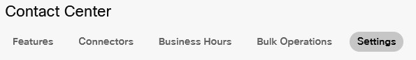

## Table of Contents
- [Introduction](#introduction)
- [Lab Section](#lab-section)
    - [Log in](#log-in)
    - [Bulk import audio files](#bulk-import-audio-files)
    - [Sync Users and Launch the Contact Center Portal](#sync-users-and-launch-the-contact-center-portal)
    - [Configure your teams](#configure-your-teams)
    - [Configure your users](#configure-your-users)
    - [Create a queue](#create-a-queue)
    - [Create your first flow](#create-your-first-flow)
    - [Create your Entry Point](#create-your-entry-point)
    - [Create your Entry Point mapping](#create-your-entry-point-mapping)
    - [Test your configuration](#test-your-configuration)

# Introduction
 In this lab we be be ensuring that we are set for success by configuring our testing agents, setting up our queues and teams as well as validating our testing numbers with a testing flow.

# Lab Section

### Log in 
1. Open the [Control Hub](https://admin.webex.com/){:target="_blank"} in your browser
2. Click Contact Center in the left frame

### Bulk import audio files

1. Download the lab audio file using this link [Audio Files](files/CL_Audio1.zip){:target="\_blank"}
2. Click Bulk Operations in the top ribbon
3. Click Create Bulk Operation
4. Select Audio Files from the drop down
5. Drag the zip file to the import box or brows for the zip file
6. Click Next

### Sync Users and Launch the Contact Center Portal
1. Click Settings in the top ribbon   

2. Click Synchronize Users
3. Click the Go to Webex Contact Center Management Portal link at the bottom of the page

### Configure your teams
1. Click on Provisioning > Team
2. Click on `+ New Team`.
    > Site: site-1
    >
    > Name: CLTeam
    >
    > Type: Agent Based
    >
    > Multimedia Profile:  Default_TelePhony_Profile
    >
3. Click Save
4. Click on `+ New Team`.
    > Site: site-1
    >
    > Name: CLTeam
    >
    > Type: Agent Based
    >
    > Multimedia Profile:  Default_TelePhony_Profile
    >
5. Click Save

    ---

### Configure your users
1. Click on Provisioning > Users.
2. Click on the ellipsis `...` next to CL23IVR+pod1agent1
3. Click Edit
4. Switch Contact Center Enabled to Yes
5. Fill out the agent setting
   >
   > Site: Site-1
   >
   > Teams: CLTeam
   >
   > Agent profile: Agent-Profile (Auto WrapUp)
   >
   > Multimedia Profile:  Default_TelePhony_Profile
   >
6. Click Save
7. Click on the ellipsis `...` next to CL23IVR+pod1agent2
8.  Click Edit
9.  Switch Contact Center Enabled to Yes
10. Fill out the agent settings
   >
   > Site: Site-1
   >
   > Teams: CLTeam
   >
   > Agent profile: Agent-Profile (Auto WrapUp)
   >
   > Multimedia Profile:  Default_TelePhony_Profile
   >
11. Click Save

    ---

### Create a queue
1. 
 
Click on Provisioning > Entry Points/Queues > Queue

   
    > 
   
   

2. Click New Queue
    > Name: Service
    >
    > Description: optional
    >
    > Channel Type: Telephony
    >
    > Queue Routing Type: Longest Available Agent
    > 
    > Call Distribution:
    >> Click Add Group
    >>
    >> Select CLTeam
    >>
    >> Save Group
    >>
    >>
    >> Click Close
    >
    > ---
    >
    > Service Level Threshold: 60
    >
    > Maximum Time in Queue: 600
    >
    > Default Music in Queue: defaultmusic_on_hold.wav
    >
    > Save
    >
    > ---

### Create your first flow
1. Download the [Flow Template](flows/flow_template.json){:target="\_blank"}
   > The file will open in a separate window.  
   >
   > 
 
If using Firefox, Select the save option.

   >
   > 
   >
   > 

   >
   > 
 
If using Chrome or Edge, right click and select save.

   >
   >
   >
   > 

      ---
2. 
 
Click Routing Strategy

    
   

   

3. Click on Flows in the top ribbon 
4. Click Import
5. Select flow_template
6. 
 
Click the ellipsis next to the newly imported flow_template and select Open 

    
    
    

   

   > Click on the Play Message node
   >> Audio File: welcome.wav 
   >
   > ---
   > Click on the Queue Contact node
   >> Select Static Queue
   >>
   >> Queue: Service
   >>
   > ---
   >
   > Click on the Play Music node
   >> Select Static Audio File
   >>
   >> Music File: defaultmusic_on_hold.wav
   >>
   >  ---
   >
   > Click the Validation switch to turn on validation
   >
   > Click Publish Flow
   > 
   > Add a Publish Note of your choosing
   >
   > Click Publish Flow
   >
   > Click Return to Flow
   > 
   > Turn off Validation 

    ---

### Create your Entry Point

1. 
 
Click on Provisioning > Entry Points/Queues > Entry point 

    
    > 
    
     

    

2. Click New Entry Point 
    > Name your Entry Point EP_CL
    >
    > Description: optional
    >
    > Channel Type: telephony
    >
    > Service Level Threshold: 60
    >
    > Flow: flow_template
    >
    > Music on Hold: defaultmusic_on_hold.wav
    >
    > Click Save
    >
    > ---

### Create your Entry Point mapping

1. 
 
Click on Provisioning > Entry Point Mapping

    
    > 

    

2. Click new mapping
    > In location, select "Office"
    >
    > In Available Numbers select <w class= "DN_out" >Your EP DN</w>
    >
    > In Entry point select EP_CL
    >
    > Click Save
    >
    > ---

### Test your configuration
1. Call <w class= "DN_out" >Your EP DN</w> from your supervisor extension
    > You should hear the greeting message and then the music in queue
    >
    > Go back into the Flow Control tab of your browser and click debug in the lower left corner.
    >
    > Click on the interaction from the list
    >
    > Notice how it shows the node progression and variable states of the nodes
    >

    > Go available in the agent desktop
    >> The call should be delivered to your agent extension
    >
    > End the call, Wrap-up, and Go unavailable
    >
    > ---

<button onclick="mainPage()" style="
  border-radius: 5px;
  background-color: rgb(116,191,75);
  padding: 10px;">Go To Previous Lab</button>

<button onclick="nextLab()" style="
  position: absolute;
  right: 200px;
  border-radius: 5px;
  background-color: rgb(116,191,75);
  padding: 10px;">Go to the Next Lab</button>

