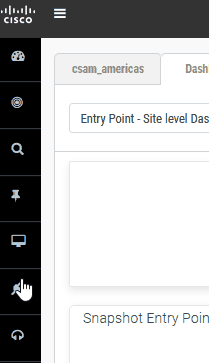
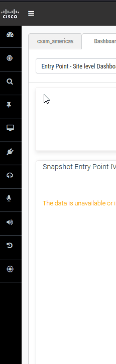
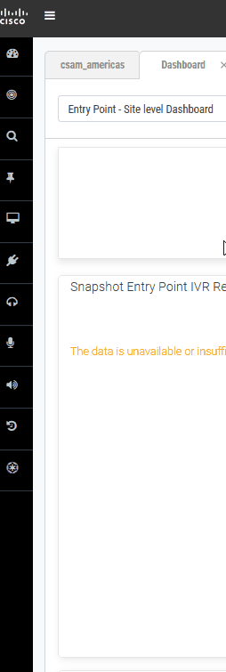

## Contact Center Links
>Control Hub: [https://admin.webex.com](https://admin.webex.com){:target="_blank"}
>
>Portal: [https://portal.wxcc-us1.cisco.com](https://portal.wxcc-us1.cisco.com){:target="_blank"}
>
>Agent Desktop: [https://desktop.wxcc-us1.cisco.com](https://desktop.wxcc-us1.cisco.com){:target="_blank"}

## Contact Center Navigation

> 
 
Navigate to Entry Points 

> 
>  
> 
> 

>
> 
 
Navigate to Map an Entry Point

>
> 
>
> 

>
> 
 
Navigate to Queues

>
> 
>
> 

>
> 
 
Navigate to Teams

>
> 
>
> 

>
> 
 
Navigate to Skills

>
> 
>
> 

>
> 
 
Navigate to Skills Profiles

>
> 
>
> 

>
> 
 
Navigate to Flow Builder

>
> 
>
> 

>
> 
 
Navigate to Bulk Updates

>
> 
>
> 

## Pebble
> Official pebble template documentation [https://pebbletemplates.io/](https://pebbletemplates.io/){:target="_blank"}

#### Retrieve the last 10 digits of an ANI 
> \{\{NewPhoneContact.ANI \| slice (NewPhoneContact.ANI.length -10,NewPhoneContact.ANI.length)\}\}

#### Retrieve the last 10 digits of an DNIS
> \{\{NewPhoneContact.DNIS \| slice (NewPhoneContact.DNIS.length -10,NewPhoneContact.DNIS.length)\}\}

#### Retrieve the nth value of a delimitated string
> Requires an integer variable and a delimitated string starting with the first element being 1
>
> \{\{string \| split(",",string \| split(",") \| length-(string \| split(",") \| length-number)) \| last \| split(",") \| first\}\}
>
> 

### Time

#### Time Now
> \{\{now()\}\}

#### Time Now as Epoch
> \{\{now() \| epoch\}\}

 

## Tools and Toys
> [BRE Tool](Configuring_The_BRE.md){:target="_blank"}
>
> [JSON Path Finder](https://jsonpathfinder.com/){:target="_blank"}
>
> 