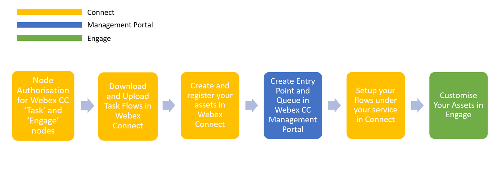

# Table of Contents

- [Step 1. Node Authorization for Webex CC Task and Engage nodes](#step-1-node-Authorization-for-webex-cc-task-and-engage-nodes)
- [Step 2. Download and upload CA (Channel Agnostic) flows in Connect](#step-2-download-and-upload-ca-flows-in-connect)

# Introduction

### Lab Objective

In this Lab, we will go through the tasks that are required to complete the general pre-configuration of a tenant. These tasks are to be undertaken by an administrator. By following each of the steps, you would have prepared your tenant to begin configuring different services offered by the platform. The lab contains multiple exercises to make you familiar with Control Hub, Management portal UI and Webex Connect. At the end of the lab, you should be able to log in to an agent interface.

### Pre-requisites

- You have received the access credentials with a full admin access.
- You have received the access to the agent and supervisor account.

### Quick Links

> Control Hub: **[https://admin.webex.com](https://admin.webex.com){:target="_blank"}**\
> Portal: **[https://portal.wxcc-anz1.cisco.com/portal](https://portal.wxcc-anz1.cisco.com/portal){:target="_blank"}**\
> Agent Desktop: **[https://desktop.wxcc-anz1.cisco.com](https://desktop.wxcc-anz1.cisco.com){:target="_blank"}**\
> Webex Connect: https://auclpod**\<ID\>**.au.webexconnect.io/ (where **\<ID\>** is your POD number)

# Lab Section

### Configuration Order

 
 

## Step 1. Node Authorization for Webex CC Task and Engage nodes

> Webex Connect is required to provide a valid access token for using various Webex Contact Center and Webex Engage APIs. The access token is generated using the Authorization details configured within the ‘Node Runtime Authorization’ field that Webex Contact Center users are required to provide during flow configuration.

- To authorize a pre-built integration go to **Assets** -> **Integrations**. The integrations which are not yet Authorised show the status as **Authorization Pending**.

- In front of **Webex CC Engage** Click **Actions** -> **Manage**.

 
 

- On the Manage Integrations page, scroll down to the **Node Authorizations** section. This section lists all the Authorizations mapped to this integration.

- Click **Action** → **Add Authorization** associated with the **Webex CC Engage Authorization**, where Auth Type is oauth2 and Status is Authorization Pending.

 
 

- Enter the Authorization Name and click **Authorize**. In that example we use **Webex CC Engage Authorization**.

 
 

- Click on the back button for being redirected back to **Integrations** page and in front of **Webex CC Task** Click **Actions** → **Manage**.

 
 

- On the Manage Integrations page, scroll down to the **Node Authorizations** section. This section lists all the Authorizations mapped to this integration. Click **Action** → **Add Authorization** associated with the **Webex CC Authorization**, where Auth Type is oauth2 and Status is Authorization Pending.

 
 

- Enter the **Authorization Name** (for example: **Webex CC Authorization**) and click **Authorize**. As the result the pop-up appears where you need to enter your Cisco admin email address (cladmin**\<ID\>**@email.carehybrid.com) and click **Sign in**.

 
 

- Click back button for being redirected back to **Integrations** page. Verify that the status of the Authorizations is changed to **Authorised**.

 
 

## Step 2. Download and upload CA flows in Connect 
> Every tenant must include CA flows. CA flows can be imported from the template folder in this [GitHub page](https://github.com/CiscoDevNet/webexcc-digital-channels){:target="_blank"}. CA flow can be added only once and will be automatically be used by all existing channel specific flows in the tenant when needed. Recommended to add these flow in a dedicated Service named “Agnostic Flows - DO NOT MODIFY”

> The agnostic flows consist of:\
> • Task Routed - Adding an agent participant to a conversation;\
> • Task Modified - Adding an agent to or removing an agent from an ongoing conversation (e.g., for chat transfer or conference);\
> • Task Close - Closing the conversation;

1) Go to > [GitHub page](https://github.com/CiscoDevNet/webexcc-digital-channels){:target="_blank"}.

2) Navigate to **Webex Connect Flows** -> **v2.1 and download the 3 files XXXX.zip**.

 
 

3) Unzip All Files.

4) Login to the **Webex Connect** portal with the admin account.

5) Navigate to **Services** and click on **CREATE NEW SERVICE**.

 
 

6) Set your name __Agnostic Flows DO NOT MODIFY__ in the Service Name and press on **CREATE** button. This will create a new service.
    > **Note**: You can choose a different Service name. It is just an exmple.

7) In the service click on **FLOWS** -> **CREATE FLOW**.

 
 

8) In the **FLOW NAME** section type **Task Close Flow**.

9) In the **METHOD** select **Upload a flow**. In **ATTACHMENT** click on **CHOOSE FILE** and select the **Task Close Flow.workflow** file.

10) Now you can click on **CREATE** button.

 
 

11) In the new menu click **SAVE** and then **MAKE LIVE**. On pop up window click on **MAKE LIVE** again.

 
 

12) **!!!** Go back and repeat steps 7 - 11 for **Task Routed flow** and **Task Modified Flow**. Select the corresponding names.

13) Verify all the flows are showing live.

 
 

[To top of this lab](#table-of-contents)

---

### Congratulations, you have compleated Lab1 tasks! 

<button onclick="mainPage()" style="
  border-radius: 5px;
  background-color: rgb(116,191,75);
  padding: 10px;">Main Page</button>

<button onclick="nextLab()" style="
  position: absolute;
  right: 200px;
  border-radius: 5px;
  background-color: rgb(116,191,75);
  padding: 10px;">Next Lab</button>

