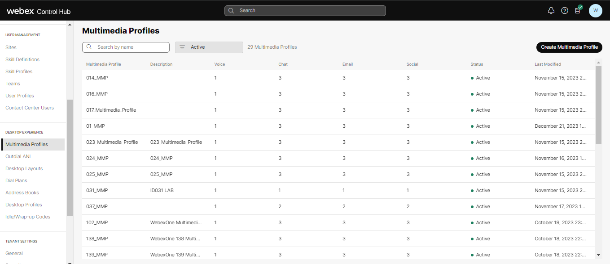
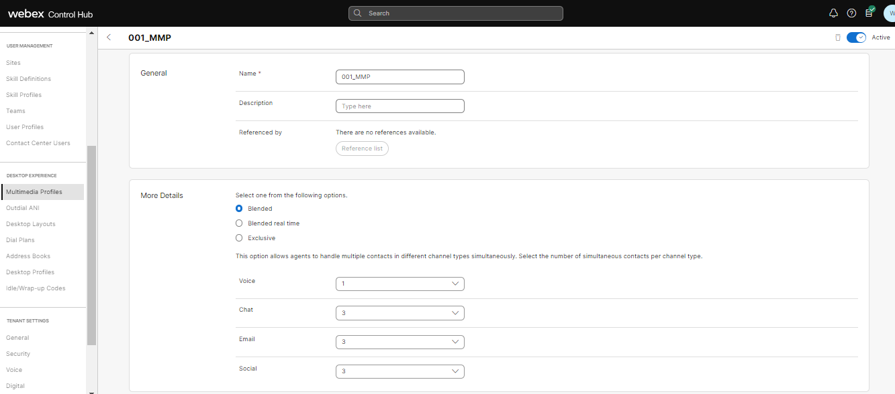
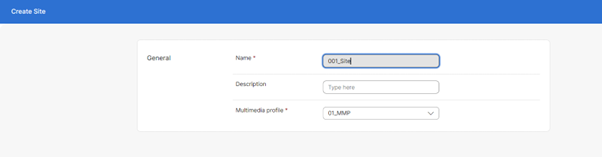
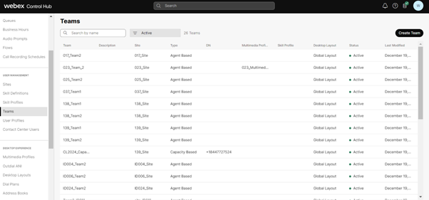
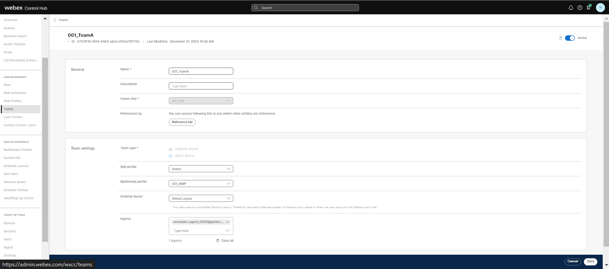
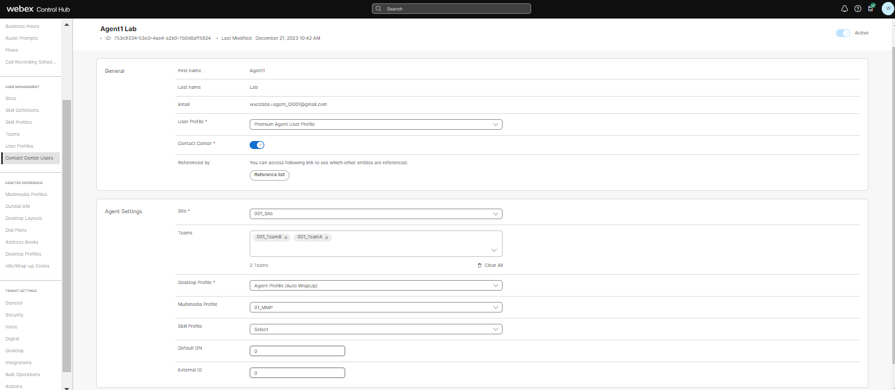

# Table of Contents

- [Table of Contents](#table-of-contents)
- [Introduction](#introduction)
    - [Lab Objective](#lab-objective)
    - [Pre-requisites](#pre-requisites)
    - [Quick Links](#quick-links)
    - [Users](#users)

- [Lab Section](#lab-section)
  - [Step 1. Node Authorization for Webex CC Task and Engage nodes](#step-1-node-authorization-for-webex-cc-task-and-engage-nodes)
  - [Step 2. Create Service and upload Live Chat flows](#step-2-create-service-and-upload-live-chat-flows)
  - [Step 3. Setup entities in Portal (Agents, Team, MMP)](#step-3-setup-entities-in-portal-agents-team-mmp)
    - [1. Create new MultiMedia Profile](#1-create-new-multimedia-profile)
    - [2. Create new Site](#2-create-new-site)
    - [3. Create new Teams](#3-create-new-teams)
    - [4. User Configuration](#4-user-configuration)
  - [Step 4. Access to the Agent Desktop](#step-4-access-to-the-agent-desktop)

# Introduction

### Lab Objective

In this Lab, we will go through the tasks that are required to complete the general pre-configuration of a tenant. These tasks are to be undertaken by an administrator. By following each of the steps, you would have prepared your tenant to begin configuring different bot functionalities that are supported with the new digital channels. The lab contains multiple exercises to make you familiar with the Control Hub, Management portal UI and Webex Connect. At the end of the lab, you should be able to log in to an agent desktop interface and also complete the basic authentications required for working with Webex Connect application.

### Pre-requisites

1. You have received the access credentials with a full admin access 
2. You have received the access to the agent account

### Quick Links

> Control Hub: **[https://admin.webex.com](https://admin.webex.com){:target="_blank"}**\
> Portal: **[https://portal.wxcc-us1.cisco.com/portal](https://portal.wxcc-us1.cisco.com/portal){:target="_blank"}**\
> Agent Desktop: **[https://desktop.wxcc-us1.cisco.com](https://desktop.wxcc-us1.cisco.com){:target="_blank"}**\
> Connect: **[https://labtenant.us.webexconnect.io/](https://labtenant.us.webexconnect.io/){:target="_blank"}**

### Users

The users have the following preconfiguration

| **User Role** | **User email**                       |
| ------------- | ------------------------------------ | 
| Admin         | wxcclabs+admin_ID**X**@gmail.com   |
| Agent         | wxcclabs+agent_ID**X**@gmail.com   | 
| Supervisor    | wxcclabs+suprv_ID**X**@gmail.com     | 

> **Note:** \<X\> is the unique **Attendee ID**. It was provided to you personally

# Lab Section

## JUST READ, ALREADY CONFIGURED
## Step 1. Node Authorization for Webex CC Task and Engage nodes

> Webex Connect is required to provide a valid access token for using various Webex Contact Center and imiengage APIs. The access token is generated using the authorization details configured within the ‘Node Runtime Authorization’ field that Webex Contact Center users are required to provide during flow configuration.

> Because this is a shared tenant, the nodes are already authorized. You **don't need to complete** this step, **just read** it to understand how it would be.

- Access the Webex Connect UI: **[https://labtenant.us.webexconnect.io/]**

- To authorize a pre-built integration go to Assets > Integrations. The integrations which are not yet authorized show the status as **Pending Authorization**.

- In front of **Webex CC Engage** Click **Actions** → **Manage**.

 
 

- On the Manage Integrations page, scroll down to the Node Authorizations section. This section lists all the authorizations mapped to this integration.

- Click **Action** → **Add Authorization** associated with the authorization, where Auth Type is oauth2 and Status is Authorization Pending.

- Enter the Authorization Name and click **Authorize**. In that example we use **WebexCCAuth**\

- Click on the back button for being redirected back to **Integrations** page and in front of **Webex CC Task** Click **Actions** → **Manage**.

- On the Manage Integrations page, scroll down to the Node Authorizations section. This section lists all the authorizations mapped to this integration.

- Click **Action** → **Add Authorization** associated with the authorization, where Auth Type is oauth2 and Status is Authorization Pending.

- Enter the **Authorization Name** (for example: WxCCAuth) and click **Authorize**. As the result the pop-up appears where you need to enter your Cisco admin email address (wxcclabs+admin_ID**X**@gmail.com) and click **Sign in**.

> **!!!**: The status of the authorization will change to Authorized and all the nodes under this authorization are authorized and ready for use.

## Step 2. Service creation
> In order to attach your Entry Point to a digital channel, you must create a Service first. In this Service you will create your channel flows.

- Login to the **Webex Connect portal** ([https://labtenant.us.webexconnect.io/]) with your admin account (wxcclabs+admin_ID**X**@gmail.com).

- Navigate to **Services**, click on **CREATE NEW SERVICE** and set a name using your **Attendee ID**.

## Step 3. Setup entities in Portal (Agents, Team, MMP)

> This step shows how to access the admin portal and navigate the different configuration menus to create a Site, Team, and Multimedia Profile that will be assigned to the Contact Center user. 

### 1. Create new MultiMedia Profile

- Login to Control Hub by accessing [https://admin.webex.com](https://admin.webex.com){:target="\_blank"}.

- Enter the admin email address (wxcclabs+admin_ID**X**@gmail.com) and click **Sign in**

- In the left navigation bar, go to **Services > Contact Center**. Under **Desktop Experience**, select **_Multimedia Profiles_**.

- Click on `Create Multimedia Profile` and input a Name with your **AttendeeID** (`X_MMP`)

- In the Media Details section, select the blended multimedia profile and input `1` for **_Voice_**, `3` for **_Chat_**, `3` for **_Email_**, , `3` for **_Social Channel_** and click on **_Save_** button

### 2. Create new Site

- Under **User Management**, select **_Sites_**.

- Click on `Create Site` button and input a Name with your **AttendeeID** (`X_Site`)

- Select the `X_MMP` in the **_Multimedia Profile_** drop down and hit **_Save_**.

### 3. Create new Teams

- Under **User Management**, select **Teams**.

- Click on `Create Team` and input a Name with your **AttendeeID** (`X_Team1`)

- Select `X_Site` from the **_Site_** drop-down.

- Use the default **_Type_** `Agent Based`.

- Select `X_MMP` in the **_Multimedia Profile_** drop-down.

- Left as a default value **_Global Layout_** in the **_Desktop Layout_** drop-down and hit **_Save_**.

- Please follow the same steps as above to add an extra Team as `X_Team2`. 

[To top of this lab](#table-of-contents)

### 4. User Configuration

- Under **User Management**, select **Contact Center Users**.

- Click on your agent user **AgentX_Lab** user to edit that particular user.

- Make sure that the **_User Profile_** is set as **_Premium Agent User Profile_** 

- Click on **_Contact Center Enabled_** toggle to move it to **_On_**.

- In the **_Agent Settings_** section, select `X_Site` in the **_Site_** drop-down.

- Click the **_Teams_** area and select `X_Team1` and `X_Team2`.

- Select `Agent Profile` in the **_Agent Profile_** drop-down list.

- Select `X_MMP` in the **_Multimedia Profile_** drop-down and hit **_Save_**.

- Make sure that the user are now shown with the **_Contact Center Enabled_** flag as `ON` and **_Status_** as `Active`.

- Please follow the same steps for **SupervisorX Lab** user. 

## Step 4. Access to the Agent Desktop
> **Note**: To log in to the agent desktop, use either a separate web browser or a new incognito web page. This will prevent any browser caching issues with admin and agent credentials.

- Navigate to **[https://desktop.wxcc-us1.cisco.com/](https://desktop.wxcc-us1.cisco.com/){:target="_blank"}** in a new browser or in incognito mode.

- Enter the agent’s **email ID** `wxcclabs+agent_ID**X**@gmail.com`.

- Enter the **Password** for the appropriate Username.

- In the **_Station Login_** pane, select **"Extension"** and put **any number**; for example: 1000
> **Note:** We are not going to make or receive any call, so this extension doesn't matter, we just need it for the login.

- Select the `X_Team1` and click **_Submit_**. Make sure that you are successfully logged in to the Agent Desktop. Now you can continue with the next section.

[Back to top](#table-of-contents)

### Congratulations, you have completed this section!

---

<button onclick="mainPage()" style="
  border-radius: 5px;
  background-color: rgb(116,191,75);
  padding: 10px;">Go To Previous Lab</button>

<button onclick="nextLab()" style="
  position: absolute;
  right: 200px;
  border-radius: 5px;
  background-color: rgb(116,191,75);
  padding: 10px;">Go to the Next Lab</button>

