# Table of Contents
- [Table of Contents](#table-of-contents)
- [Introduction](#introduction)
    - [Lab Objective](#lab-objective)
    - [Pre-requisite](#pre-requisite)
    - [Quick Links](#quick-links)
- [Lab Section](#lab-section)
  - [Step 1. Live Chat Asset creation & register to Webex CC](#step-1-live-chat-asset-creation--register-to-webex-cc)
  - [Step 2. Chat Template creation for website integration](#step-2-chat-template-creation-for-website-integration)
  - [Step 3. Chat Channel and Queue creation](#step-3-chat-channel-and-queue-creation)
    - [1. Create Channel in Control Hub](#1-create-channel-in-control-hub)
    - [2. Create Queue in Control Hub](#2-create-queue-in-control-hub)
  - [Step 4. Website Settings](#step-4-website-settings)
    - [1. Configure Live Chat widget](#1-configure-live-chat-widget)
    - [2. Verify that live chat widget loads](#2-verify-that-live-chat-widget-loads)
  - [Step 5. Create/Upload Live Chat flow](#step-5-createupload-live-chat-flow)
	  - [1. Initial flow loading](#1-initial-flow-loading)
	  - [2. Start node and Custom Variables](#2-start-node-and-custom-variables)
    - [3. Select Live Chat form](#3-select-live-chat-form)
    - [4. Set FlowID in Resolve Conversation node](#4-set-flowid-in-resolve-conversation-node)
    - [5. Define Queue](#5-define-queue)
    - [6. Publish the flow and repeat for Close workflow](#6-publish-the-flow-and-repeat-for-close-workflow)
  - [Step 6. Verification - start live chat and accept the request](#step-6-verification---start-live-chat-and-accept-the-request)

# Introduction

### Lab Objective

In this Lab, we will go through the tasks that are required to complete the basic Live chat integration. You will be able to initiate a Chat contact to the Contact Center from a sample website and be able to accept/respond to the contact by logging in as an agent.

In this lab you will be configuring Service, Chat Assets, Channel, Queue, Chat Template, Website Settings, and corresponding workflows.

### Pre-requisite

1. You received an admin credentials to configure in Control Hub and Webex Connect.
2. You have successfully completed the **Lab 1.1 - Environment setup**

### Quick Links

> Control Hub: **[https://admin.webex.com](https://admin.webex.com){:target="_blank"}**\
> Portal: **[https://portal.wxcc-us1.cisco.com/portal](https://portal.wxcc-us1.cisco.com/portal){:target="_blank"}**\
> Agent Desktop: **[https://desktop.wxcc-us1.cisco.com](https://desktop.wxcc-us1.cisco.com){:target="_blank"}**\
> Connect: **[https://labtenant.us.webexconnect.io/](https://labtenant.us.webexconnect.io/){:target="_blank"}**

# Lab Section

## Step 1. Live Chat Asset creation & register to Webex Engage

- Login to your respective Webex Connect UI using the provided URL **[https://labtenant.us.webexconnect.io/](https://labtenant.us.webexconnect.io/){:target="_blank"}**

- Navigate to `Assets` > `Apps` > `Configure New App` > `Mobile / Web`

 
 

- Provide a `Name`

- Toggle/Enable `Live Chat / In-AppMessaging` to "ON" and choose `PRIMARY TRANSPORT PROTOCOL` as  MQTT" & `SECONDARY TRANSPORT PROTOCOL` as Web Socket" and enable `Use Secured Port` and `SAVE`.

 
 

- Select `Register To Webex Engage`, choose the Service you have created previously and `REGISTER`

 
 

- In the resulting window, select a service under which this asset would be managed

 
 

- Verify that the `Register To Webex Engage` option is now disabled and there is a message indicating the time when the asset was registered along with the service to which it is assigned.

 
 

- Click the back arrow next to go back to the list of Apps. Then **copy of the App ID**, we will need this later.

 
 

## Step 2. Chat Template creation for website integration

- Chat template creation allows you to configure a pre-defined chat form that will presented to the customer. Data points can be collected from the customer in a chat-like interface.

- From Webex Connect interface, go to `TOOLS` > `Templates` then click on `Add New Template`

 
 

- Provide a Name and choose Channel as `Live Chat / In-APP Messaging`

- Message Type as `Form`

- Provide the Title as `Welcome to Webex CC Live Chat` or some other message.

 
 

- We will be adding form fields now. Firstly the Name. Click on `Add field` and then fill in the details as per the screenshot

 
 

- Continue by adding the `Email` and `Reason` fields in the same manner with the info in this table.

| Type     | Name        | Label                    | Mandatory Field |
| -------- | ----------- | ------------------------ | --------------- |
| Name     | Name        | Name                     | true            |
| Email    | Email       | Email                    | true            |
| Dropdown | Reason      | Reason for Contacting Us | true            |
| Text     | Description | Description              | false           |

Here is a screenshot of the Dropdown configuration with 2 options, one for **Sales** and one for **Support**. 

 
 

- Finally click `SAVE`

 
 

## Step 3. Chat Channel and Queue creation

### 1. Create Channel in Control Hub

- Go to [https://admin.webex.com](https://admin.webex.com) and select **Channels** under **Customer Experience**.
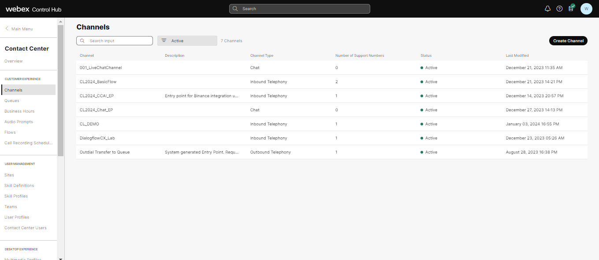

- Click on `Create Channel` and input a Name with your **AttendeeID** (`X_ChatChannel`).

- Select `Chat` in the **_Channel Type_** section.

- In **_Asset Name_** select the asset configured in Connect portal.

- Set **_Service Level Threshold_** as `300` seconds.

- The **_Time Zone_** can stay as default value.

- Click on **Save** after comparing your values with the screenshot below.

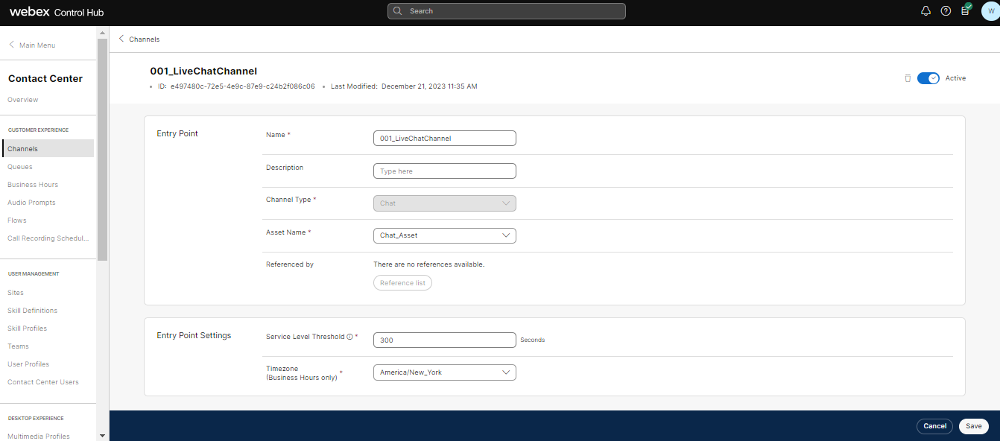
 
 

### 2. Create Queue in Control Hub

- Under **Customer Experience**, select **Queues**.
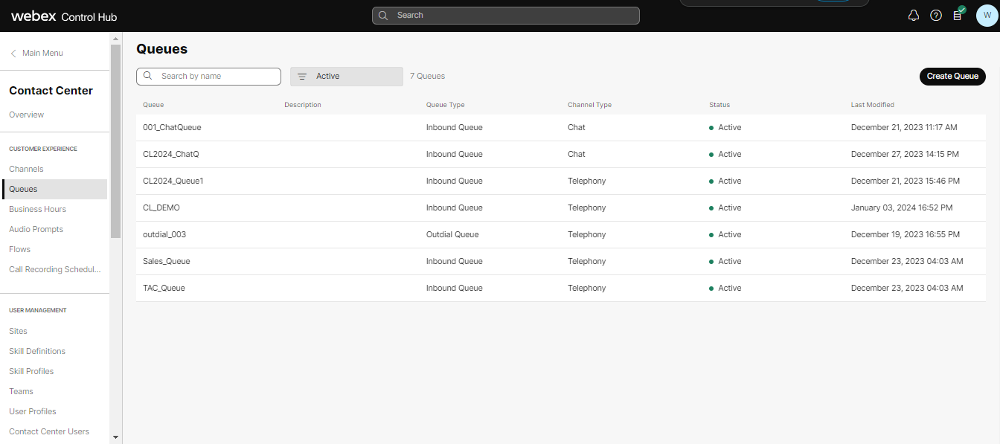

- Click on `Create Queue` and input a Name with your **AttendeeID** (`X_ChatQueue`).

- Select `Chat` in the **_Channel Type_** section.

- Select **_Queue Routing Type_** as `Longest Available Agent`.

- In the the **_Chat Distribution_** click on **Add Group** and select `X_Team1`.

- Set **_Service Level Threshold_** as `90` seconds.

- Set **_Maximum Time in Queue_** as `600` seconds.

- The **_Time Zone_** can stay as default value.

- Click on **Save** after comparing your values with the screenshot below.

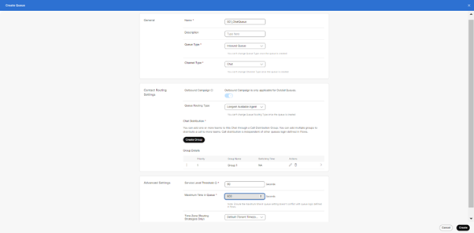
 
 

## Step 4. Website Settings

### 1. Configure Live Chat widget
- Navigate to [Control Hub](https://admin.webex.com){:target="_blank"}, go to Contact Center and click on the **Webex Engage hyperlink** under "Quick Links".

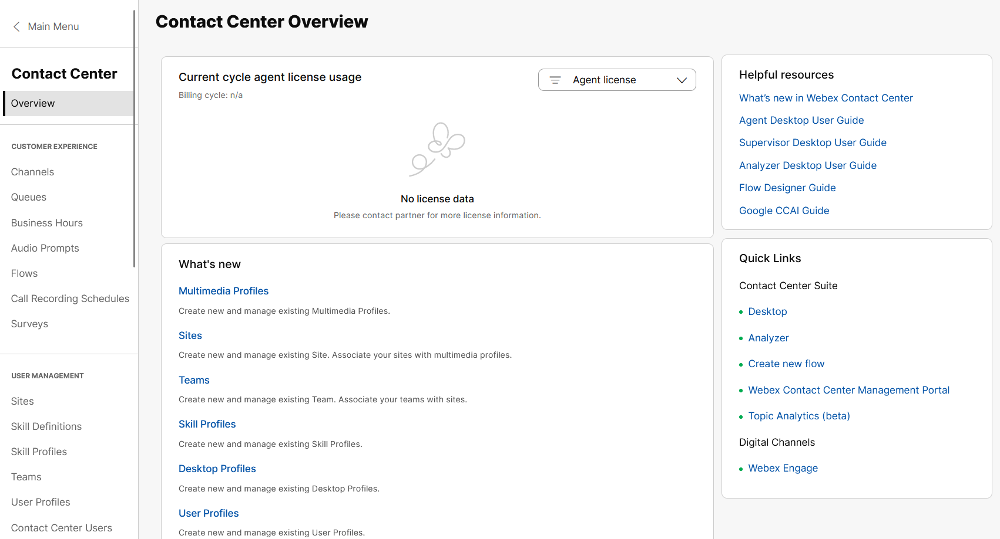
 
 

- Go to `Assets` > search and edit the chat asset which we created earlier in **Step 1**

 
 

 
 

- Scroll to top of the page and choose `Websites` and then click `Add Website`

 
 

- Enter the respective fields as per Screenshots below. Note we are going to insert the chat bubble into an online HTML editor for testing *.glitch.me. The `Domain` field should contain the domain where you will insert the chat bubble.

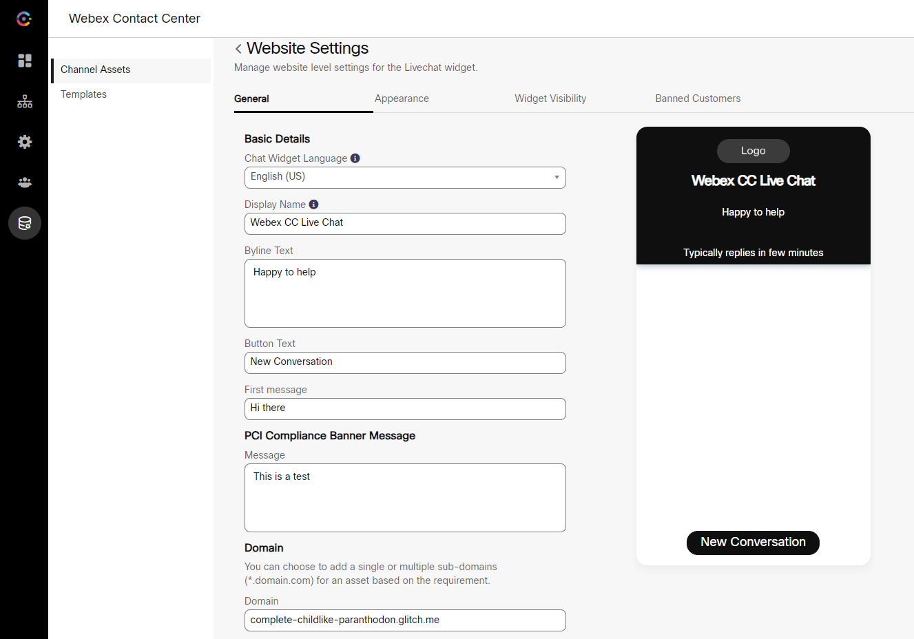
 
 

- Take a moment to explore the rest of the customization options for the chat bubble and then click `SAVE CHANGES`

- Scroll up, select the `Appearance` tab and change the settings (Widget Color, Logo, Emojis, attachments etc.;) as per your requirement and `SAVE CHANGES`

- Select the `Widget Visibility` tab and click on `Show without restriction` and `SAVE CHANGES`

 
 

- Explore and `Banned Customers` tab so you are familiar with the settings but we are not going to change the default settings for those at this point

### 2. Verify that live chat widget loads

- There's still a few bits to configure but we can now verify that the live chat widget loads.

- Go back to Webex Engage portal, LiveChat > edit the Livechat asset you created, click on installation tab and Copy the chat script code.

 
 

- Navigate to [Glitch.com](https://glitch.com/){:target="_blank"} and login at the right top corner. It accepts logging in using Google, Facebook credentials too.
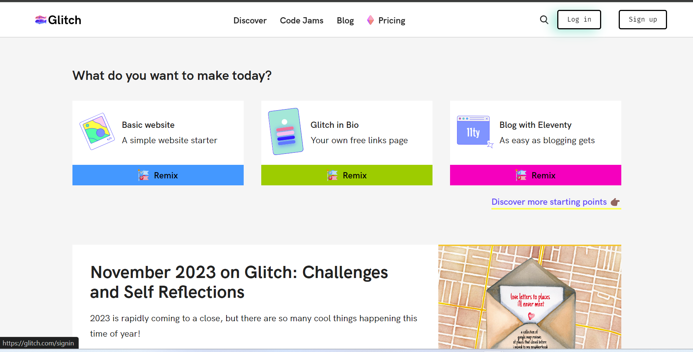

- After logging in, click on "New Project" button seen at the right top corner & select 'glitch-hello-website" option. It takes few seconds to create new project for you.

- On the left side, click on "index.html" option & in the HTML code that opens in the right side pane, scroll down to the bottom of page.

- Create a line by hitting enter after </footer> & paste the code copied from Webex Engage (from the asset installation tab) on that line.

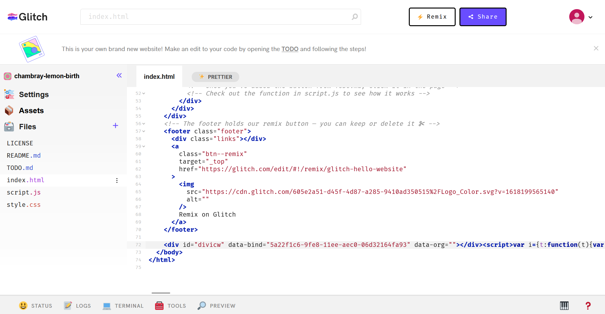

- Go back to glitch.com portal & click on Preview option seen at the bottom of page. If everything is good then you should see the Chat bubble displayed there.

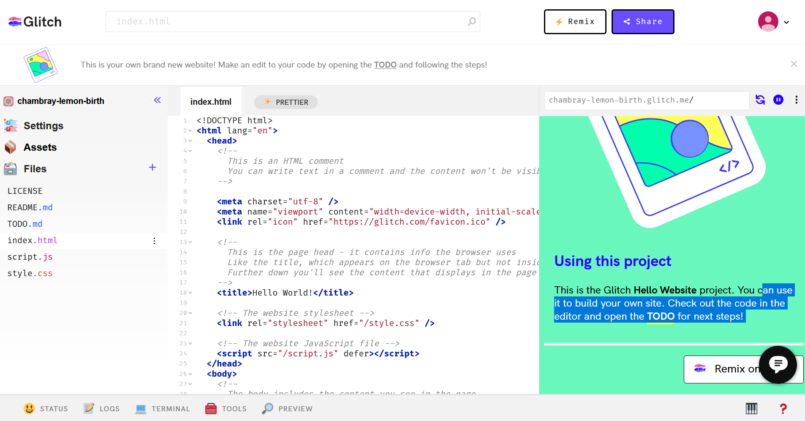

- Copy the created website link, we will need it later.

## Step 5. Create/Upload Live Chat flow

### 1. Initial flow loading
- Download the default **Inbound and Close Chat Flow** from the [GitHub page](https://github.com/CiscoDevNet/webexcc-digital-channels){:target="_blank"}.

- Navigate to **Webex Connect Flows/v3.1/Template/Media Specific Workflows** -> click on **LiveChatInboundFlow.workflow.zip** and click download. 

- Unzip the downloaded file.

- Go to Webex Connect, click on **Services** and select the service in which the Asset is created in step 2. It should be **My First Service**

- In the service click on **FLOWS** -> **CREATE FLOW** .

 
 

- Enter the **FLOW NAME** as **Live Chat Inbound Flow**, select the **TYPE** as **Work Flow** and under **METHOD** select **Upload a flow**.

- Drag and drop the **Live Chat Inbound Flow.workflow** flow file that you unzipped, click **CREATE** and then click **SAVE**.

 
 

### 2. Start node and Custom Variables

- A page will load with the imported workflow. We must make some changes to the default inbound flow based on our setup.

- First Click `Save` in the `Configure APP Event` page that loaded, this defines what will trigger the flow and the default settings are already good.

 
 

- Click on the gear button on the top right to load the flow settings dialog

 
 

- Select the Custom Variables tab and set the following variable defaults:

*appid*: Set it to the value you copied in Step1

*liveChatDomain*: Input your Glitch web domain

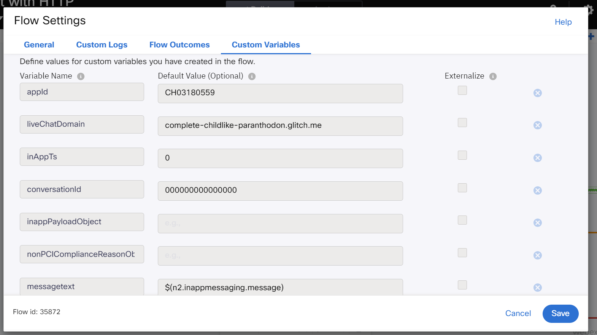
 
 

- **In your production setup, domain should be set to your website's domain.**

### 3. Select Live Chat forms

- We must select the right Live Chat Template as configured earlier so that the right Form is presented to the customer. Click on the `Pre-chat form` node, select the `Form Template` configured before and `Save`

 
 

- The same must be done in the Receive node, double click on it and select the Form from the dropdown menu and `Save`

 
 

### 4. Set FlowID in Resolve Conversation node
- Go to Resolve Conversation node and fill in Flow Id field with flowId value copied from the address bar of web browser tab. In this example, Flow Id is 4464. Then save changes.

 
 

### 5. Define Queue

- In the created workflow find the **Queue Task**, click twice, select the Queue created before and click on **SAVE**.

 
 

> **NOTE**: Ignore Skill settings in the GIF. In this case we created a `Longest Available Agent` type of Queue.

### 6. Publish the flow and repeat for Close workflow
- Finally click on Make Live on top right corner -> Select the Application/Asset that we have created and click `Make Live`.

 
 

- Wait for 2 minutes and verify that the flow is published successfully.

 
 

- Repeat the same and upload the **Live Chat Close Workflow** downloaded before
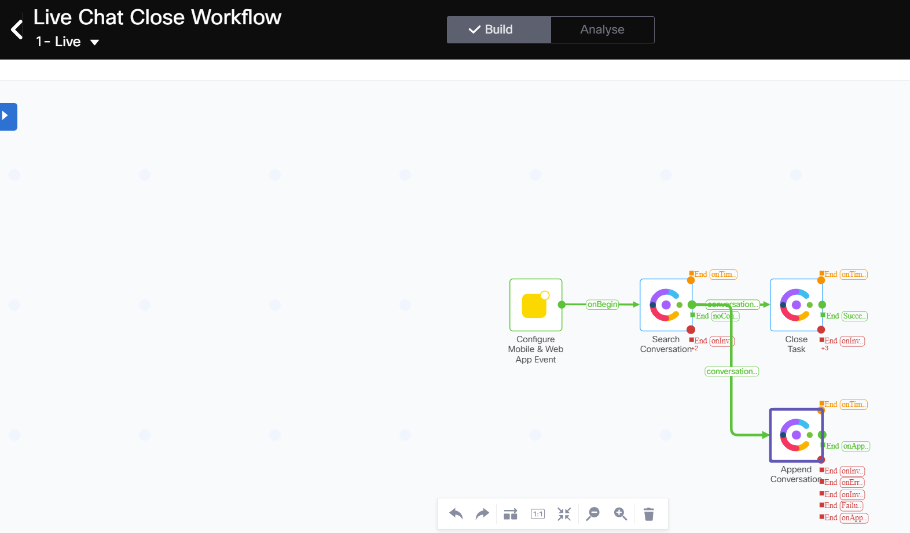
 
 

## Step 6. Verification - start live chat and accept the request.

- Open a new incognito tab, login to the [Agent Desktop](https://desktop.wxcc-us1.cisco.com){:target="_blank"} with the agent credentials and make the agent Available.

 
 

- Open a new tab in your browser and navigate to the Glitch website previously created (you copied the website URL in previous step, it should be something ending on *.glitch.me).

- Click on the chat bubble icon and it should show the previously configured livechat widget.

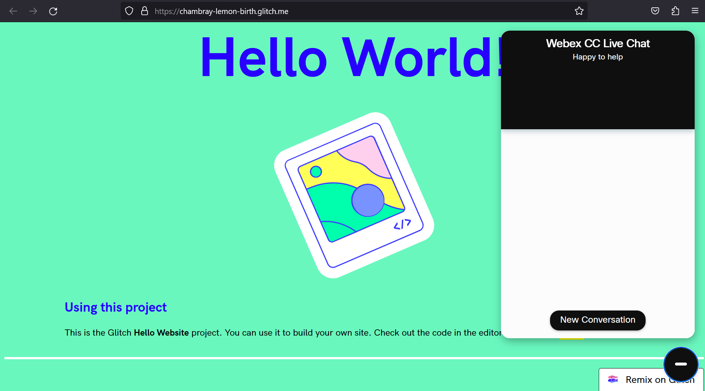
 
 

- Click `Start Conversation`

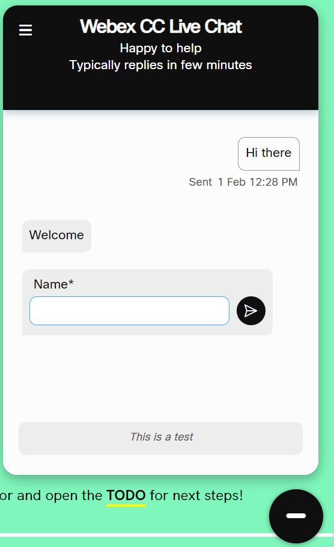
 
 

- Fill in the form with customer options

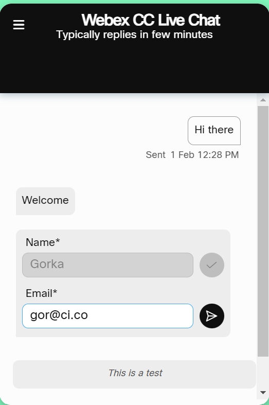
 
 

- The Live Chat will be offered to the agent. Click **Accept** to handle the Chat.

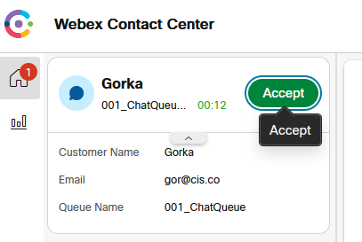
 
 

- The form submission will be presented to the Agent

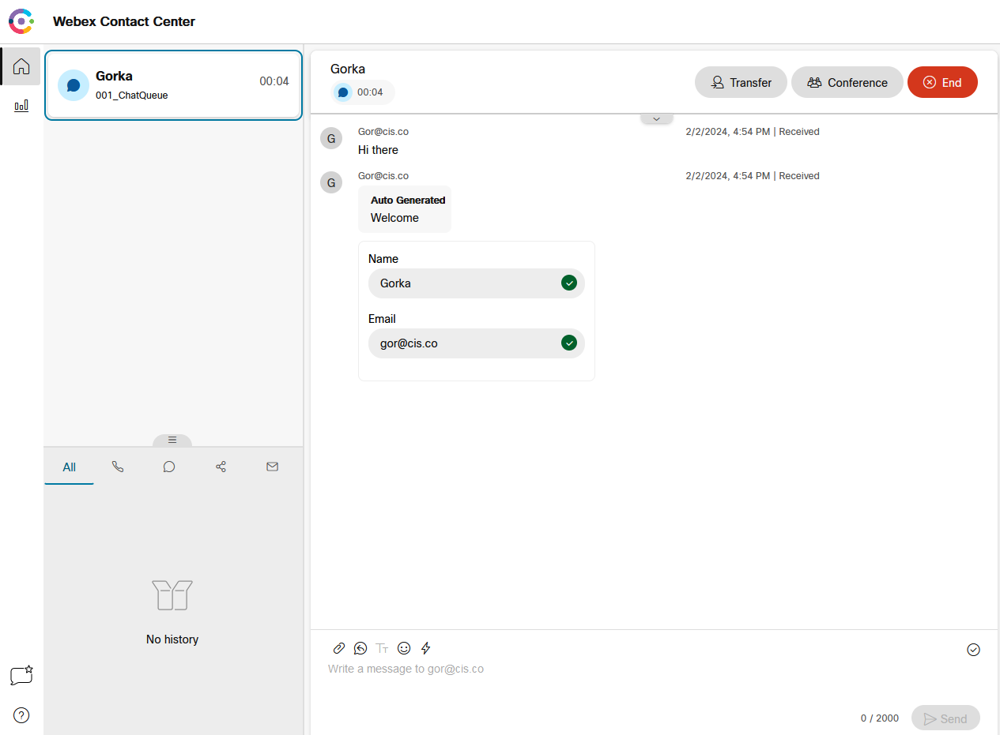
 
 

- Type a response and hit send button.

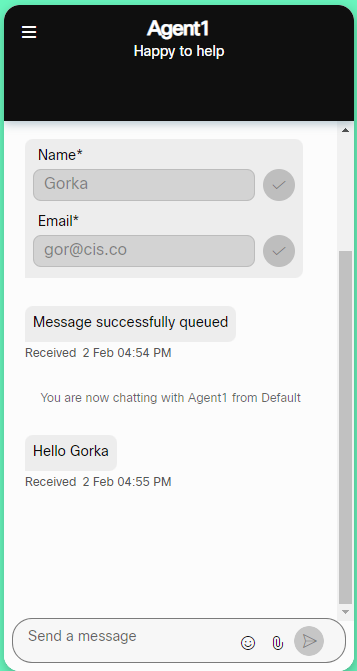
 
 

- End the contact and select a Wrap up code to close the task.

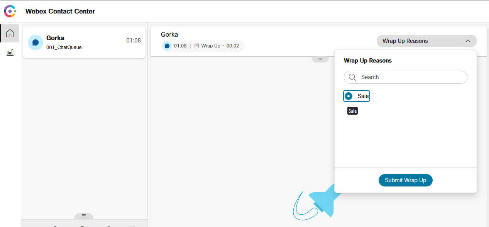
 
 

[Back to top](#table-of-contents)

### Congratulations, you have completed this section!

<button onclick="mainPage()" style="
  border-radius: 5px;
  background-color: rgb(116,191,75);
  padding: 10px;">Go To Previous Lab</button>
<button onclick="nextLab()" style="
  position: absolute;
  right: 200px;
  border-radius: 5px;
  background-color: rgb(116,191,75);
  padding: 10px;">Go to the Next Lab</button>

