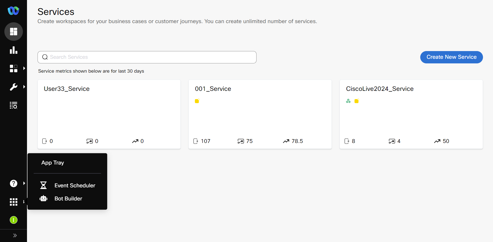
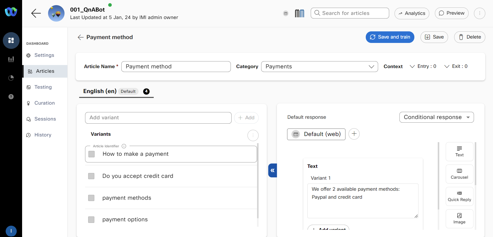
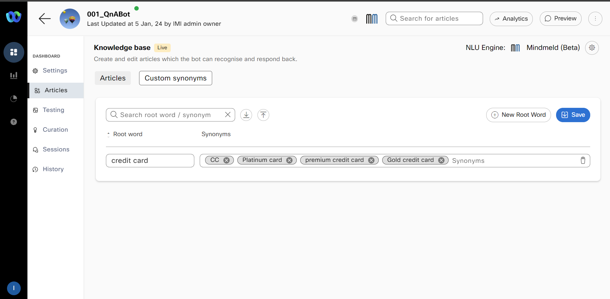
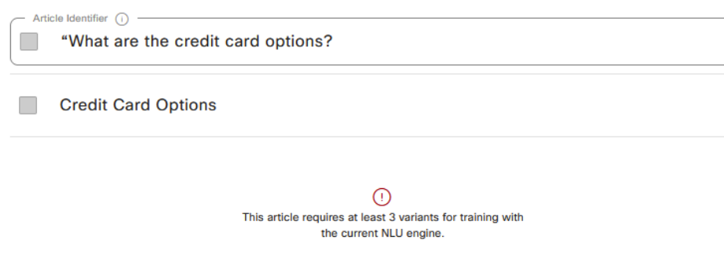
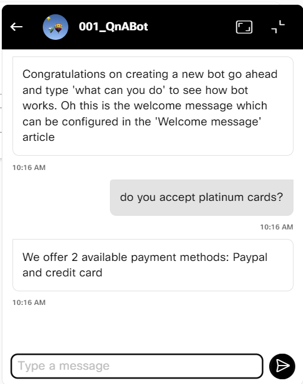
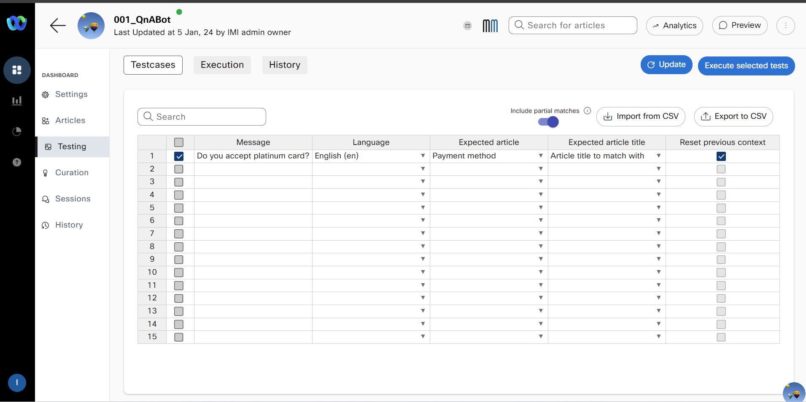
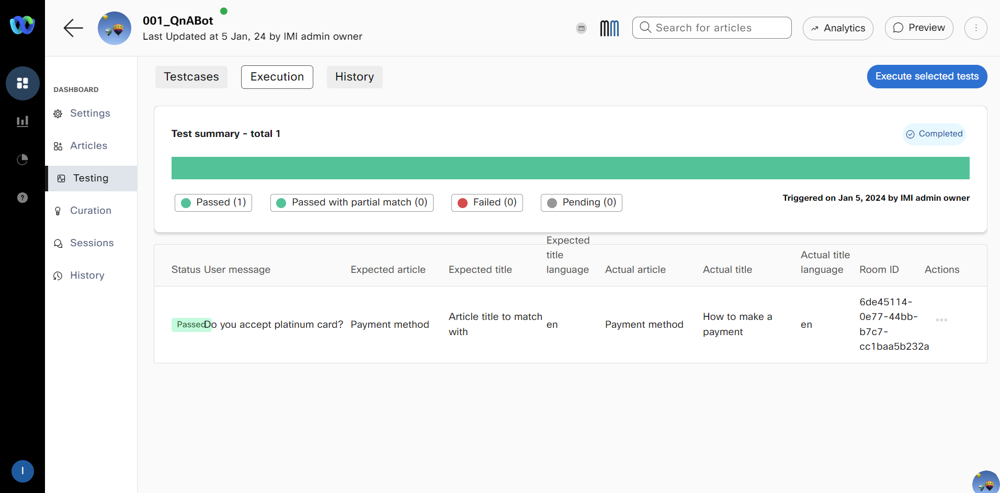

# Table of Contents
- [Table of Contents](#table-of-contents)
- [Introduction](#introduction)
    - [Lab Objective](#lab-objective)
    - [Pre-requisites](#pre-requisites)
    - [Quick Links](#quick-links)
- [Lab Section](#lab-section)
  - [Step 1. Navigate to Bot builder and create Bot](#step-1-navigate-to-bot-builder-and-create-bot)
  - [Step 2. Create Article, Custom Synonyms, select NLU engine and Make bot live](#step-2-create-article-custom-synonyms-select-nlu-engine-and-make-bot-live)
  - [Step 3. Preview Bot](#step-3-preview-bot)
  - [Step 4. Bot testing](#step-4-bot-testing)

# Introduction

### Lab Objective

In this Lab, we will go through the tasks that are required to complete the general pre-configuration of Question and Answer bot in Webex Connect. 

### Pre-requisites

- You have received the access credentials with a full admin access 

### Quick Links

> Control Hub: **[https://admin.webex.com](https://admin.webex.com){:target="_blank"}**\
> Portal: **[https://portal.wxcc-us1.cisco.com/portal](https://portal.wxcc-us1.cisco.com/portal){:target="_blank"}**\
> Agent Desktop: **[https://desktop.wxcc-us1.cisco.com](https://desktop.wxcc-us1.cisco.com){:target="_blank"}**\
> Connect: **[https://labtenant.us.webexconnect.io/](https://labtenant.us.webexconnect.io/){:target="_blank"}**

# Lab Section

> **NOTE**: Please read carefully the lab guide and follow the instructions. It might be possible that some GIFs are not accurate.
{: .block-warning }

## Step 1. Navigate to Bot builder and create Bot

- Login to Webex Connect UI using the provided URL **[https://labtenant.us.webexconnect.io/](https://labtenant.us.webexconnect.io/){:target="_blank"}**
  
- Navigate to App Tray and Bot Builder

 
 

- Click on 'New Q&A Bot', input a name for this bot (using your **Attendee ID**) and enable **_Allow Agent Handover_**. Then, save it by clicking on **_Done_**.

## Step 2. Create Article, Custom Synonyms, select NLU engine and Make bot live

- Navigate to **_Articles_** and click **_Create new article_**

- Input Title and fill the **_Variants_** for this article. These are the questions that you will make to the bot. For example: "What are the credit card options?"

- Add the response that should be displayed for these questions on the right. For example: "We offer 2 available payment methods: Paypal and Credit card"

- Assign this category to **Credit card** category.

- Click **Save and train**  to train your existing model with the current corpus.

 
 

- This knowledge base should show as Trained with the new article added along with the variants

- Navigate to **Custom synonyms** tab in the articles section and click on **+ New root word**

- Configure the **root word** value and its synonyms and click **Save**

 
 

- Click **NLU Engine** on the right side of the page. The Change training engine window appears. Select **Mindmeld** and click **Update**
	- Swiftmatch is a fast, lightweight training engine that supports multiple languages
	- RASA is a leading open-source conversational AI framework
	- Mindmeld (Beta) is an advanced conversational AI framework that produces quality conversational flows and offers various NLU capabilities.
  

> **NOTE**: Error would show up requesting to add 2 more variants 

  
 
 

- Once all the desired articles are created, **Train** the bot and **Make it Live**

## Step 3. Preview Bot
 
- Click on **Preview** on top right and test the bot. 

 
 

- The shareable preview widget enables bot developers to share their bot with stakeholders and consumers in a presentable manner without the need of developing a custom UI to surface the bot. 

- Click the three dots next to the **Preview** option on the top right and **Copy Preview Link**

- Open the link in a new browser tab. By default, the copied preview link renders the bot with phone casing. Developers can do some quick customization by changing certain parameters in the preview link.
  

## Step 4. Bot testing 

- Click on **Testing** and add test case. The test cases can be configured by entering a message and an Expected Template in the respective columns as shown below. This is extremely helpful in testing a large set of test cases easily and quickly

- Tests defined on the **Test cases** tab can be executed from the **Execution** tab. Click the  **Execute tests** button and **Continue** 

 
 

- All the test cases defined on the previous tab will be run sequentially and the result of each test case run is shown next to the test case

- All test case executions are available to be viewed on-demand in the “History” tab. 

 
 

[Back to top](#table-of-contents)
---

### Congratulations, you have completed this section! 

<button onclick="mainPage()" style="
  border-radius: 5px;
  background-color: rgb(116,191,75);
  padding: 10px;">Go To Previous Lab</button>

<button onclick="nextLab()" style="
  position: absolute;
  right: 200px;
  border-radius: 5px;
  background-color: rgb(116,191,75);
  padding: 10px;">Go to the Next Lab</button>

