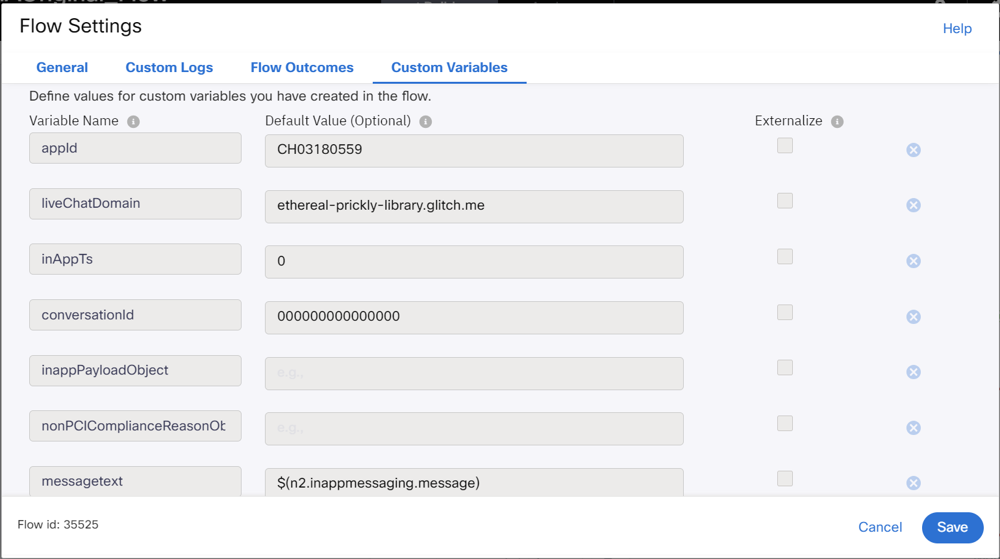
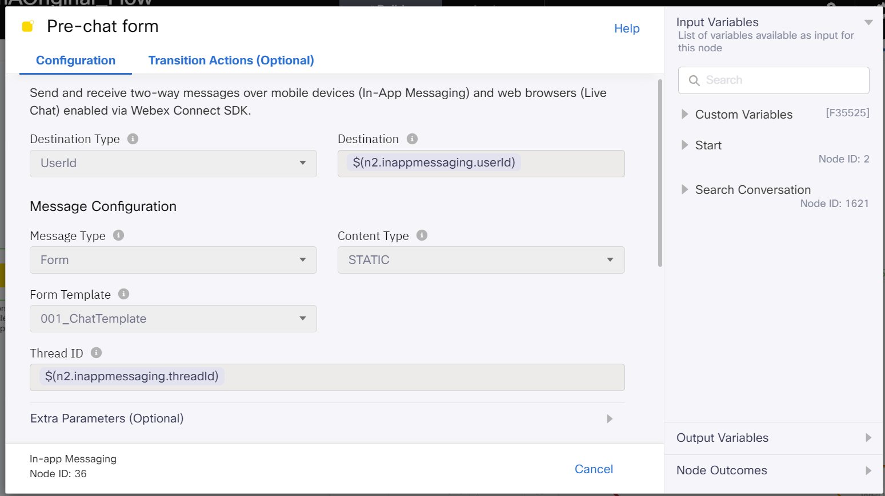
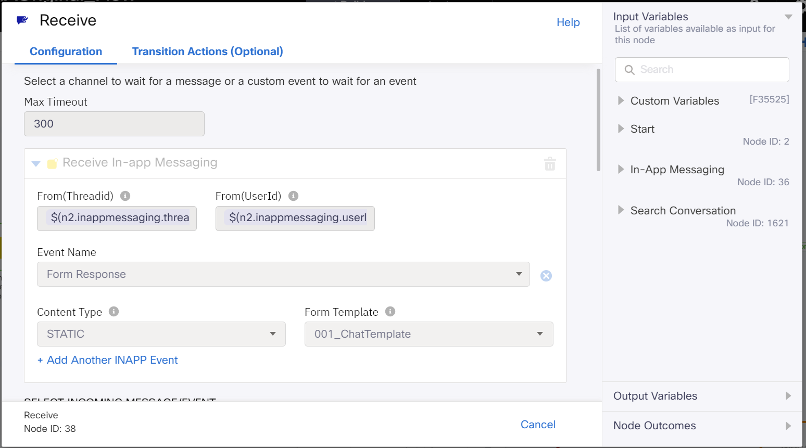
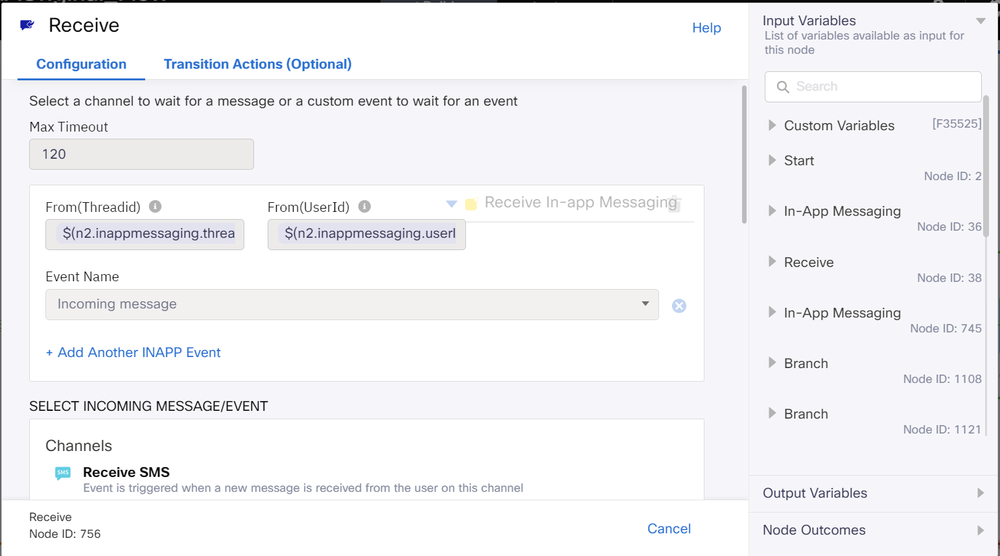
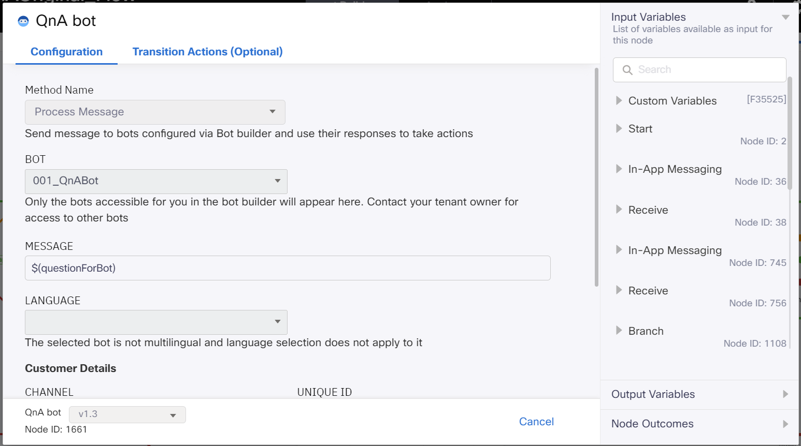
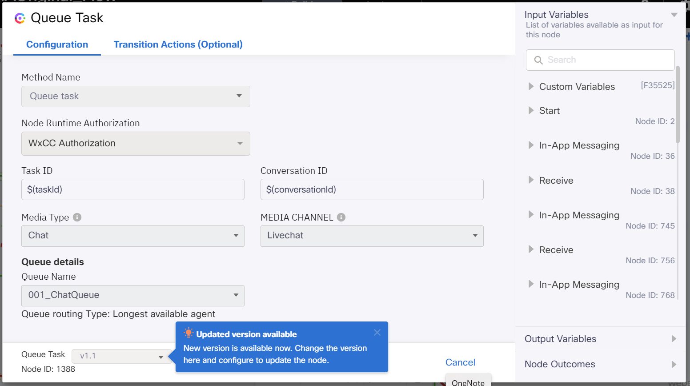

# Table of Contents
- [Table of Contents](#table-of-contents)
- [Introduction](#introduction)
    - [Pre-requisites](#pre-requisites)
    - [Quick Links](#quick-links)
- [Lab Section](#lab-section)
  - [Step 1. Import bot flow](#step-1-import-bot-flow)
  - [Step 2. Update parameters in flow](#step-3-update-parameters-in-flow)
  - [Step 3. Bot flow verification](#step-3-bot-flow-verification)

# Introduction

In this Lab, we will go through the tasks that are required to complete the QnA bot flow configuration. At the end of this lab, a chat session can be initiated and either self serviced or can be escalated to an agent. 

### Pre-requisites

- You have received the access credentials with a full admin access 
- Lab 2 should be completed successfully and chat routing to agent is working
- The previous sections in Lab 3 should be completed successfully

### Quick Links

> Control Hub: **[https://admin.webex.com](https://admin.webex.com){:target="_blank"}**\
> Portal: **[https://portal.wxcc-us1.cisco.com/portal](https://portal.wxcc-us1.cisco.com/portal){:target="_blank"}**\
> Agent Desktop: **[https://desktop.wxcc-us1.cisco.com](https://desktop.wxcc-us1.cisco.com){:target="_blank"}**\
> Connect: **[https://labtenant.us.webexconnect.io/](https://labtenant.us.webexconnect.io/){:target="_blank"}**

# Lab Section

## Step 1. Import bot flow

- Download the template Q&A bot flow from this link: [Live Chat Q&A Bot pre-configured flow](LiveChatQABotInboundFlow.workflow)  

- Navigate to Services, select the service in which the chat configurations were created and click on Create Flow

- Input desired  **Flow Name**, select **Method** as 'Upload a flow', choose the flow downloaded in the first step of this section and click on **Create**

- In the trigger event node, click **Save**

 

## Step 2: Update parameters in flow

- Navigate to settings in the top right > Custom variables and update the appID (value identified in previous Lab 1, you can find it in **Assets**) and click Save

 
- Update the **LiveChat Website Domain** with the domain where chat code was deployed (<yourDomain>.glitch.me) and click **Save**

 

- Choose the templates created in Lab 2 in **Pre-chat form** and **Receive** nodes.

 

 
- Open the second **Receive** node and click **Save**

 

- Open the **QnABot** node and select the QnA bot created in the previous section

 

- Open the **Queue task** node and select the chat queue created in Lab-2

 
- On the top right click **Make Live** > Select the chat application and click **Save** . The flow will be published in less than 2 minutes

## Step 3: Bot flow verification 

- Launch the website where chat code is deployed (this should have been completed as part of Lab 2. Click the chat widget and then **New Conversation** . Input chat form details and Enter. 

 

 
- Test the bot with the sample questions configured while creating the bot in earlier section of this lab and verify that the response received from bot matches one of the configured response variants. 

 
 
- To escalate this conversation to an agent, enter **Agent** or **Escalate to agent**

 
- The conversation would be offered to an available agent. Login to agent desktop and Click **Accept**

- Once the chat contact is accepted by the agent, verify that bot conversation history is persisted and presented to agent. 

 

[Back to top](#table-of-contents)
---

### Congratulations, you have completed this section! 

<button onclick="mainPage()" style="
  border-radius: 5px;
  background-color: rgb(116,191,75);
  padding: 10px;">Go To Previous Lab</button>

<button onclick="nextLab()" style="
  position: absolute;
  right: 200px;
  border-radius: 5px;
  background-color: rgb(116,191,75);
  padding: 10px;">Go to the Next Lab</button>

