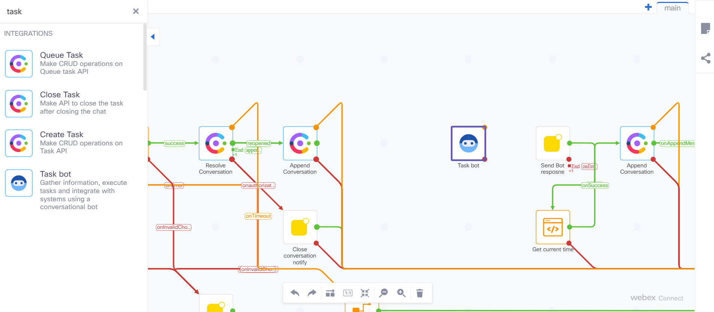
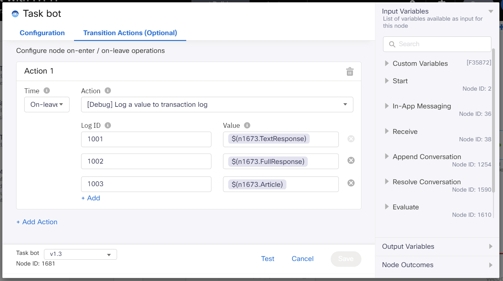
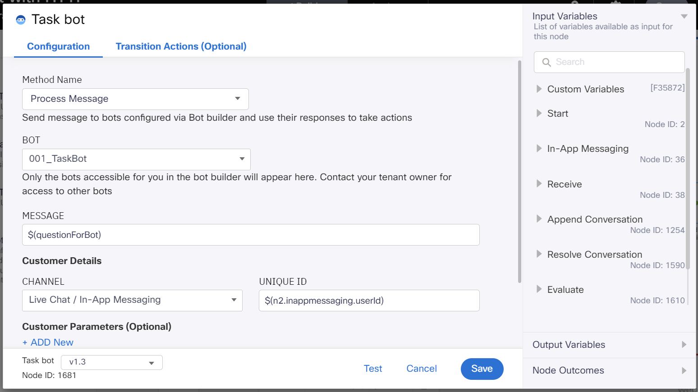
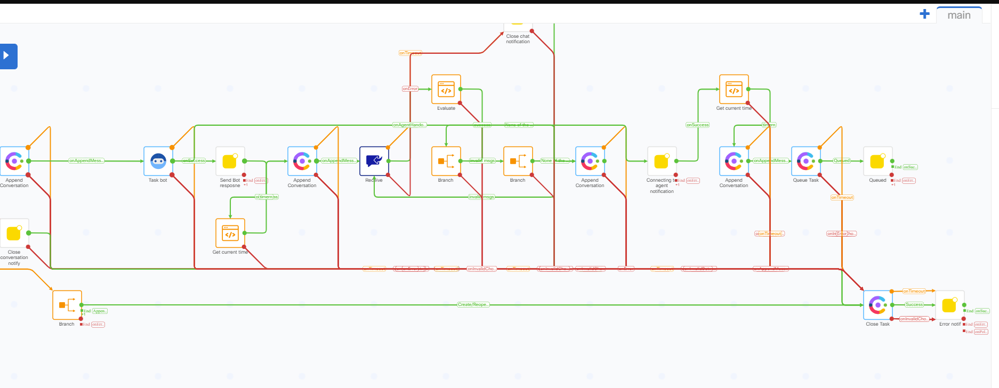
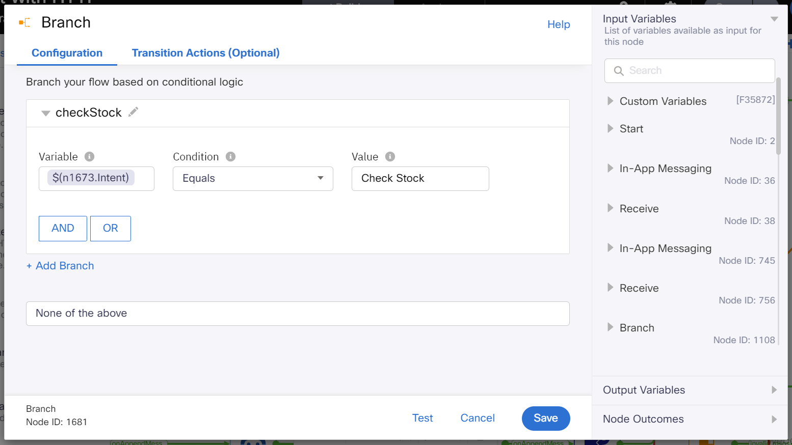
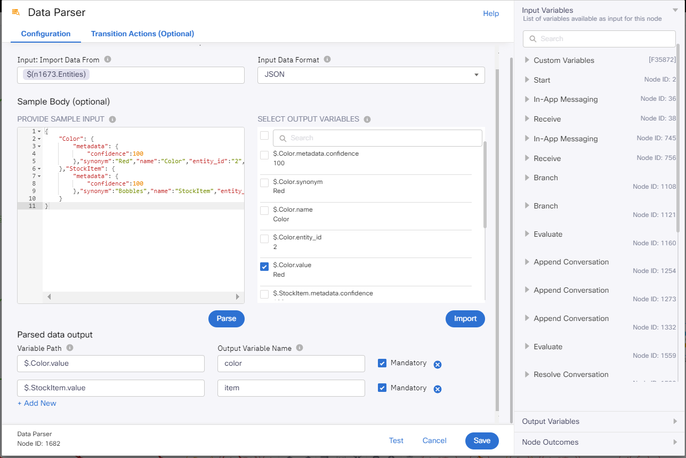
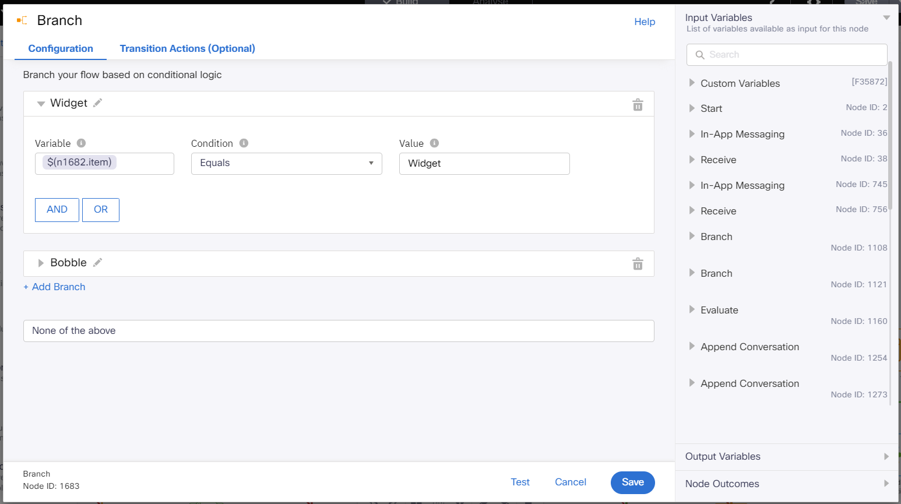
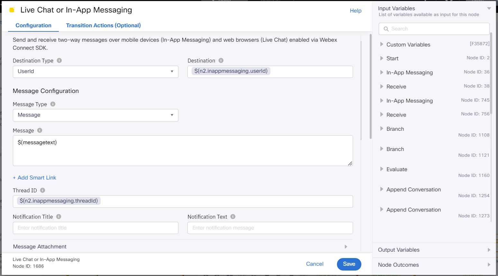
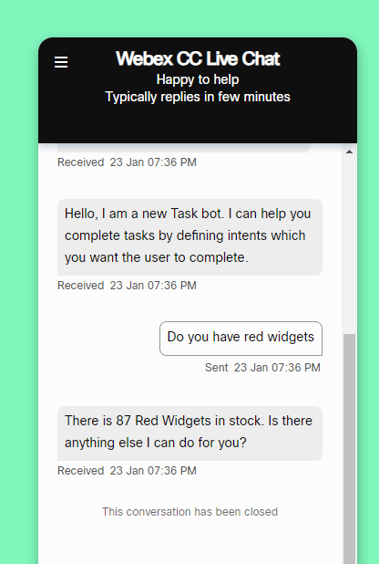

# Table of Contents
- [Table of Contents](#table-of-contents)
- [Introduction](#introduction)
    - [Lab Objective](#lab-objective)
    - [Pre-requisites](#pre-requisites)
    - [Quick Links](#quick-links)
- [Lab Section](#lab-section)
  - [Step 1. Replace QnA bot with Task Bot](#step-1-replace-qna-bot-with-task-bot)
  - [Step 2. Check Intent, parse Entities and get number of Items](#step-2-check-intent-parse-entities-and-get-number-of-items)
  - [Step 3. Send the answer to the created conversation](#step-3-send-the-answer-to-the-created-conversation)

 

# Introduction

## Lab Objective

In this lab we will modify the default Chat Flow to integrate our task bot. We will collect the intents from the end-customer and get the value of the requested information using HTTP Requests.

### Pre-requisites

1. You have received the access credentials with a full admin access 
2. Lab 2 should be completed successfully and chat routing to agent is working
3. The previous sections in Lab 3 should be completed successfully

### Quick Links

> Control Hub: **[https://admin.webex.com](https://admin.webex.com){:target="_blank"}**\
> Portal: **[https://portal.wxcc-us1.cisco.com/portal](https://portal.wxcc-us1.cisco.com/portal){:target="_blank"}**\
> Agent Desktop: **[https://desktop.wxcc-us1.cisco.com](https://desktop.wxcc-us1.cisco.com){:target="_blank"}**\
> Connect: **[https://labtenant.us.webexconnect.io/](https://labtenant.us.webexconnect.io/){:target="_blank"}**

# Lab Section

## Step 1. Replace QnA bot with Task Bot
- Retun to Services

- Click on `Create Flow` select `Copy from existing flow` and choose the QnA bot flow created in previous lab

- Delete the QnA bot node (all previous links will be removed as well) and replace it with a Task Bot node

- Open the Task bot node and set the following parameters
  > Method name: Process Message
  > Message: $(questionForBot)
  > Channel: Live Chat / In-App Messaging
  > Unique ID: $(n2.inappmessaging.userId)

  > Time: On-leave
  > Action: [Debug] Log a value to transaction log
    > Log 1001: $(<taskNodeID>.TextResponse)  
    > Log 1002: $(<taskNodeID>.FullResponse)  
    > Log 1003: $(<taskNodeID>.Article)  

- Restablish the previous links
  - From "Append Conversation" to "Task Bot" when `onAppendMessageSuccess`
  - From "Task Bot" to "Send Bot response" when `onSuccess`
  - From "Task Bot" to "Connecting agent notification" when `onAgentHandover`
  - All "Task Bot" warning and error edges to "Close Task"

- Replace the taskNodeID used for some variables
  - Message parameter on "In Send Bot response" node
  - Text parameter on "Append Conversation" node after Task Bot
  - Text parameter on the last "Append Conversation" node

- Click Save in the upper right corner and click on `Make Live`

- Confirm the proper application is selected and click `Make Live` again.

- Navigate to your website (The one defined as Channel Asset in Webex Engage) and test your bot. For example, you can ask: `Do you have red widgets?`

- You should see how the bot answers with the defined response in previous Lab 3.1

  
## Step 2. Check Intent, parse Entities and get number of Items

- If you want to keep the Task Bot basic working flow, create a copy of that flow. If not, you can continue editing that one

- If you copied the flow, please make sure that the code in `Evaluate` and `Get current time` nodes is correct. In case it's not, copy the code from the QnA bot nodes and paste it

- Delete the link between `Task bot` and `Send bot response` nodes

- Add Branch node and link it with Task bot `onSuccess` edge

- Open the Branch node and set the condition
  > Rename the Condition to `checkStock` 
  > Variable: $(n1673.Intent)
  > Condition: Equals
  > Value: Check Stock

- Connect the Branch node with the "Send Bot response"t node for error and `None of the above` edges

- Add Data Parser node and link it with the `checkStock` edge from previous Branch node

- Open the Data Parser node and set the following parameters:
    > Input: Task Bot > taskbot.entities
    >
    > Sample Body: {
       
								    "Color": {
								        "metadata": {
								            "confidence":100
								        },"synonym":"Red","name":"Color","entity_id":"2","value":"Red"
								    },"StockItem": {
								        "metadata": {
								            "confidence":100
								        },"synonym":"Bobbles","name":"StockItem","entity_id":"1","value":"Bobbles"
								    }
							    }

    >> Click Parse
    >
    > Select the $.Color.value and $.stockItem.value
    > 
    >> Click Import
    >
    > Create Output variable names (like color and item)
    > 	$.Color.value -> color
    > 	$.StockItem.value -> item
    >
    >> Make both Variables Mandatory

- Add another Branch node and link it with Data Parser `onSuccess` edge

- Open the Branch node and set the following parameters:
> Rename Branch1 to Widget
 >> Variable: Data Parser > item
 >> Condition: Equals
 >> Value: Widget
 >> Add branch
 >> 
> Rename Branch2 to Bobble
 >> Variable: Data Parser > item
 >> Condition: Equals
 >> Value: Bobble

- Now add 2 new HTTP Request nodes and connect them with the previous Branch node (select `Widget` for one of them and `Bobble` for the other one) 

- Open one of the HTTP Request nodes

- Click Configuration
  > Method: GET
  >
  > Endpoint URL: Custom Variables > stockURL
  >
  > Connection Timeout: 1000
  >
  > Request Timeout: 1000
  >
  > Output Variable Name: itemCount
  >
  > Response Entity: Body 
  >
  > Response Path: $[0].stockcount
  >

- Click on Transition Actions and set the following parameters:
  > Click Add Action
  >
  > Time: On-Enter
  >
  > Action: Set Variable
  >
  > Variable:
    >>
    >> Add an new variable
    >>
    >> Variable name: stockURL
    >>
    >> Click Save
  >
  > Value: https://629f77cc8b939d3dc2987fa4.mockapi.io/api/v1/Widget?$(n2316.color)
  
  >
  >> This value is Widget "database" url + parsed color 
  >
  >> Be aware that `n2316` is an example, make sure to put correct NodeID of your Data Parser node
  >
- Add action
  > Time: on-leave
  >
  > Action: Set variable
  >
  > Variable: messagetext
  >
  > Value: There is (output variables > itemCount) (Data Parser > color) (Data Parser > item)s in stock. Is there anything else I can do for you?  
  >
  

- Do the same with the other HTTP Request node. You just need to change the value of the stockURL with the appropiate entity (`Bobble` instead of `Widget`): 
  > https://629f77cc8b939d3dc2987fa4.mockapi.io/api/v1/Bobble?color=$(n2316.color)

## Step 3. Send the answer to the created conversation

- Drag a new Live Chat or In-App Messaging node and link it with both HTTP Request nodes

- Open the Live Chat or In-App Messaging node and set the following parameters:
  > Destination type: UserId
  >
  > Destination: Start > inapppessaging.userId $(n2.inappmessaging.userId)
  >
  > Message Type: Message 
  >
  > Message: Custom Variables > messagetext
  >
  > Thread ID: Start > inappmessaging.threadId $(n2.inappmessaging.threadId)
  >
    

 

- Drag a new Append Conversation and link it with the Live Chat or In-App Messaging node

- Open the Append Conversation node and set the following parameters:
  > Method Name: Append Chat
  >
  > Node Runtime Authorization: Pick default
  >
  > Channel: Livechat
  >
  > Conversation ID: Custom Variables > conversationId
  >
  > Message Type: Text With Attachments
  >
  > Direction: Outbound
  >
  > Text: messagetext $(messagetext)
  >
  > Timestamp: Start > inappmessaging.timestamp 
  >
  > Attachments: null
  >

 
- Connect the Green node edge to the Receive node 

- Connect all remaining Red and Orange node edges to the Close Task node 

- Click Save in the upper right corner and click on `Make Live`

- Confirm the proper application is selected and click `Make Live` again.

- If you copied the flow, remember to disable the other flow Task Bot flow

- Navigate to your website (The one defined as Channel Asset in Webex Engage) and test your bot. For example, you can ask: `Do you have red widgets?`

- The difference with Step 1 is that the bot gives you the number of existing items

[Back to top](#table-of-contents)

### Congratulations, you have completed this section! 

<button onclick="mainPage()" style="
  border-radius: 5px;
  background-color: rgb(116,191,75);
  padding: 10px;">Go to the Previous Lab</button>

<button onclick="nextLab()" style="
  position: absolute;
  right: 200px;
  border-radius: 5px;
  background-color: rgb(116,191,75);
  padding: 10px;">Go Back to the Beginning</button>

